---
# Title, summary, and page position.
linktitle: Tuffo nelle stelle
summary: ""
weight: 10
icon: message-question
icon_pack: fas

# Page metadata.
title: Tuffo nelle stelle
date: 2022-11-15
type: book # Do not modify.
commentable: true
tags: "Missioni di Mothership Zeta"
hidden: true # Visibile nella sidebar
private: false # Nascosto dalle ricerche
---

*Tuffo nelle stelle* è una missione del DLC *Mothership Zeta* di Fallout 3. È data da Sally.

<section class="chart-collapse">
<input type="checkbox" name="collapse2" id="handle2">
<h3 class="handle">
<label for="handle2">Clicca per mostrare il diagramma</label>
</h3>

</section>

```mermaid
%%{init: {'theme': 'base', 'themeVariables': { 'primaryColor': '#282a36', 'primaryBorderColor': '#4eff01', 'primaryTextColor': '#fff', 'lineColor': '#4eff01', 'fontFamily': 'Jura'}}}%%
graph TD;
    id1(<b>Tuffo nelle stelle</b>):::questfo3
    id2(Parla con Sally)
    id3(Vai nei crio-laboratori)
    id4("(Opzionale) Chiedi <br />aiuto a Elliott Tercorien")
    id5(Distruggi il generatore)
    id6(Vai nell'hangar)
    id7("(Opzionale) Chiedi  <br />aiutoa Paulson") 
    id8(Distruggi il generatore)
    id9(Vai nell'area di <br />produzione dei robot)
    id10("(Opzionale) Chiedi <br />aiuto a Somah")
    id11(Distruggi il generatore)
    id12(Prendi la tuta spaziale <br />dal Colonnello Hartigan)
    id13(Entra nella camera di <br />decompressione e <br />attiva la sequenza <br />di pressurizzazione)
    id14(Trova e attiva i tre pannelli)
    id15(Entra nel teletrasporto) 
    id16(300 PE):::rewardfo3
    id17(Prossima missione: <br /><b>Questa galassia mi sta stretta</b>):::questfo3
    id1-->id2-->id3-->id4-->id5-->id6-->id7-->id8-->id9-->id10-->id11-->id12-->id13-->id14-->id15-->id16-->id17
    
    
    
    classDef rewardfo3 fill:#4eff01, stroke:#4eff01, color:#282a36;
    classDef questfo3 fill:#4eff01, stroke:#4eff01, color:#282a36;
```

| Tappe |       Stato        | Descrizione                                                |
|:-----:|:------------------:| ---------------------------------------------------------- |
|  10   |                    | Libera gli umani in stato di animazione sospesa.           |
|  20   |                    | Parla con Sally.                                           |
|  30   |                    | Distruggi il generatore nei crio-laboratori.               |
|  35   |                    | (opzionale) Chiedi aiuto alle persone che hai resuscitato. |
|  40   |                    | Distruggi il generatore nell'hangar.                       |
|  50   |                    | Distruggi il generatore nell'area di produzione dei robot. |
|  60   |                    | Parla con Sally.                                           |
|  70   |                    | Raggiungi il livello superiore della nave aliena.          |
|  80   | :white_check_mark: | Trova un modo per attivare i teletrasportatori.            |

**Note**:
- L'area manutenzione e smaltimento rifiuti risulterà inaccessibile dopo la camminata nello spazio
- I sopravvissuti indossano degli abiti unici (tuta di Paulson, armatura ed elmo del samurai di Kago, armatura medica invernale di Tarcorien)
- Una volta distrutti tutte e tre i generatori sarà impossibile ottenere la spada del samurai da Toshiro Kago

