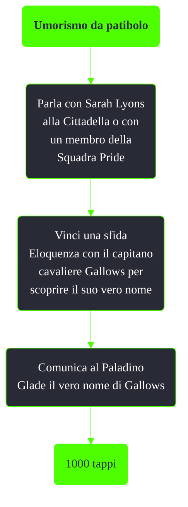

---
# Title, summary, and page position.
linktitle: Umorismo da patibolo
summary: ""
weight: 10
icon: message-question
icon_pack: fas

# Page metadata.
title: Umorismo da patibolo
date: 2022-11-15
type: book # Do not modify.
commentable: true
tags: "Missioni nascoste di Fallout 3"
hidden: true # Visibile nella sidebar
private: false # Nascosto dalle ricerche
---

*Umorismo da patibolo* è una missione nascosta di Fallout 3. E' data dalla Sentinella Lyons (o da un altro membro della Squadra Pride) alla Cittadella.

Note:
- Questa missione può essere fatta fino al completamento di *Riprenditelo!*
- Se Glade muore non sarà possibile completare la missione
- Anche con Carisma 9 e Eloquenza 100 sarà difficile convincere Gallow a rivelare il suo nome