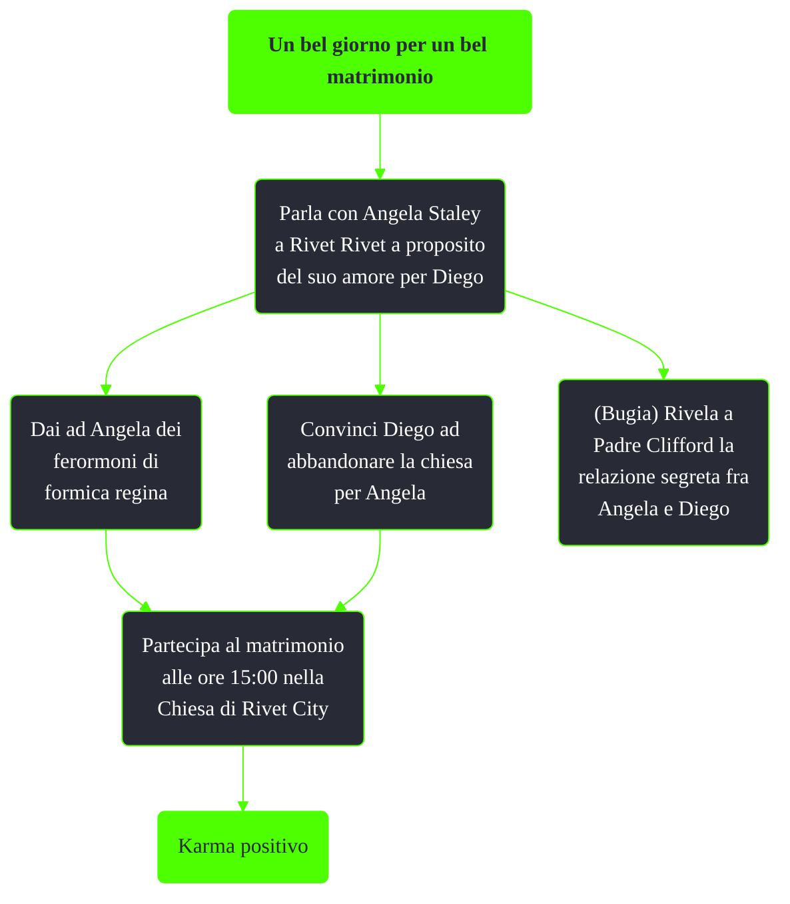

---
# Title, summary, and page position.
linktitle: Un bel giorno per un bel matrimonio
summary: ""
weight: 10
icon: message-question
icon_pack: fas

# Page metadata.
title: Un bel giorno per un bel matrimonio
date: 2022-11-15
type: book # Do not modify.
commentable: true
tags: "Missioni nascoste di Fallout 3"
hidden: true # Visibile nella sidebar
private: false # Nascosto dalle ricerche
---

*Un bel giorno per un bel matrimonio* è una missione nascosta di Fallout 3. È data da Angela Staley a Rivet City.

Note:
- I ferormoni di formica regina si possono acquistare al Quick-Fix di Rivet City o si possono ottenere uccidendo una regina delle formiche, come quella nella stazione di Marigold