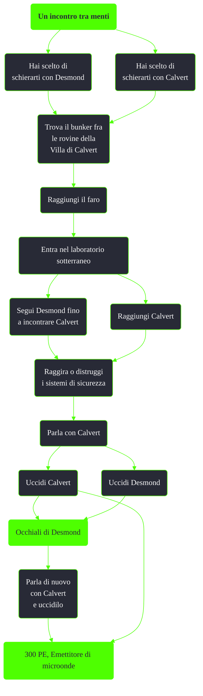

---
# Title, summary, and page position.
linktitle: Un incontro tra menti
summary: ""
weight: 10
icon: message-question
icon_pack: fas

# Page metadata.
title: Un incontro tra menti
date: 2022-11-15
type: book # Do not modify.
commentable: true
tags: "Missioni di Point Lookout"
hidden: true # Visibile nella sidebar
private: false # Nascosto dalle ricerche
---

*Un incontro tra menti* è una missione del DLC *Point Lookout* di Fallout 3. È data da TODO a TODO.

| Tappe |       Stato        | Descrizione                                 |
|:-----:|:------------------:| ------------------------------------------- |
|  10   |                    | Trova Desmond.                              |
|  15   |                    | Torna da Desmond quando ti senti pronto.    |
|  50   |                    | Segui Desmond fino al professore.           |
|  75   |                    | Parla con il professore OPPURE uccidilo.    |
|  76   |                    | Parla con il professore.                    |
|  100  |                    | Uccidi Desmond OPPURE uccidi il professore. |
|  101  |                    | Uccidi Desmond.                             |
|  102  |                    | Uccidi il professore.                       |
|  150  | :white_check_mark: | Parla con il professore.                    |
|  175  | :white_check_mark: | Uccidi il professore.                       |

| Tappe |       Stato        | Descrizione                                 |
|:-----:|:------------------:| ------------------------------------------- |
|  10   |                    | Dirigiti verso il faro.                     |
|  50   |                    | Trova Desmond e fermalo.                    |
|  100  |                    | Uccidi Desmond OPPURE uccidi il professore. |
|  125  |                    | Uccidi Desmond.                             |
|  150  |                    | Parla con il professore.                    |
|  175  |                    | Uccidi il professore.                       |
|  180  | :white_check_mark: | Uccidi il professore.                       |
|  185  | :white_check_mark: | Parla con Desmond.                          |

Note:
- Essendo un personaggio essenziale e buono, non sarà possibile ucciderlo ma ogni volta che sverrà ci sarà un orecchio nel suo inventario
	- Nonostante sia un personaggio buono, ucciderlo non farà guadagnare karma negativo
- Usciti dal laboratorio sotterraneo, è possibile imbattersi in un contrabbandiere, dotato di fucile da cecchino, appostato su un isolotto a sud
