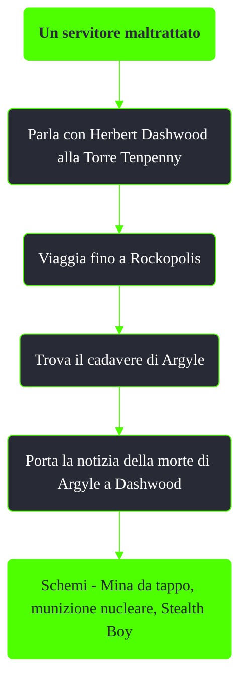

---
# Title, summary, and page position.
linktitle: Un servitore maltrattato
summary: ""
weight: 10
icon: message-question
icon_pack: fas

# Page metadata.
title: Un servitore maltrattato
date: 2022-11-15
type: book # Do not modify.
commentable: true
tags: "Missioni nascoste di Fallout 3"
hidden: true # Visibile nella sidebar
private: false # Nascosto dalle ricerche
---

*Un servitore maltrattato* è una missione nascosta di Fallout 3. È data da interagendo con il cadavere di Argyle a Rockopolis.

**Riassunto**:
1. Parla con Herbert Dashwood alla Torre Tenpenny
2. Viaggia fino a Rockopolis
3. Trova il cadavere di Argyle
4. Porta la notizia della morte di Argyle a Dashwood
5. Ricompensa: **Schemi - Mina da tappo**, **munizione nucleare**, **Stealth Boy**

<section class="chart-collapse">
<input type="checkbox" name="collapse2" id="handle2">
<h3 class="handle">
<label for="handle2">Clicca per mostrare il diagramma</label>
</h3>

</section>

**Note**:
- È necessario parlare con Herbert Dashwood prima di far entrare o uccidere Roy Phillips e i suoi ghoul nella missione *Torre Tenpenny*, altrimenti lo ritroveremo già morto o si rifiuterà di parlarci
  - In entrambi i casi sarà impossibile ottenere la chiave (borseggio o saccheggiando il cadavere)

