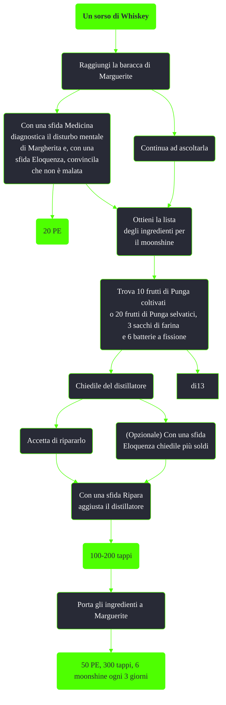

---
# Title, summary, and page position.
linktitle: Un sorso di Whiskey
summary: ""
weight: 10
icon: message-question
icon_pack: fas

# Page metadata.
title: Un sorso di Whiskey
date: 2022-11-15
type: book # Do not modify.
commentable: true
tags: "Missioni di Point Lookout"
hidden: true # Visibile nella sidebar
private: false # Nascosto dalle ricerche
---

*Un sorso di Whiskey* è una missione secondaria del DLC *Point Lookout* di Fallout 3. 

**Riassunto**:
1. Raggiungi la baracca di Marguerite
2. (Opzionale) Con una sfida Medicina diagnostica il disturbo mentale di Margherita e, con una sfida Eloquenza, convincila che non è malata: 20 PE
3. Ottieni la lista degli ingredienti per il moonshine
4. Trova 10 frutti di Punga coltivati o 20 frutti di Punga selvatici, 3 sacchi di farina e 6 batterie a fissione
5. (Opzionale) Accetta di riparare il distillatore: **100-200 tappi**
6. (Opzionale) Con una sfida Eloquenza chiedile più soldi
8. Porta gli ingredienti a Marguerite
9. Ricompensa: **50 PE**, **300 tappi**, **6 moonshine** ogni 3 giorni

<section class="chart-collapse">
<input type="checkbox" name="collapse2" id="handle2">
<h3 class="handle">
<label for="handle2">Clicca per mostrare il diagramma</label>
</h3>

</section>

| Tappe |       Stato        | Descrizione                                                                       |
|:-----:|:------------------:| --------------------------------------------------------------------------------- |
|  40   |                    | Porta a Marguerite dieci frutti di Punga coltivati oppure venti frutti selvatici. |
|  50   |                    | Porta a Marguerite tre sacchi di lievito.                                         |
|  60   |                    | Porta a Marguerite 24 bottiglie di acqua distillata.                              |
|  70   |                    | Porta a Marguerite sei batterie a fissione.                                       |
|  90   | :white_check_mark: | Vai a prendere il Moonshine da Marguerite quando il tonico è pronto.              |

**Note**:
- Con Baratto 30 per i frutti di Punga coltivati e 63 per quelli selvatici il valore totale degli ingredienti sarà superiore dei 300 tappi e del moonshine ottenuti

