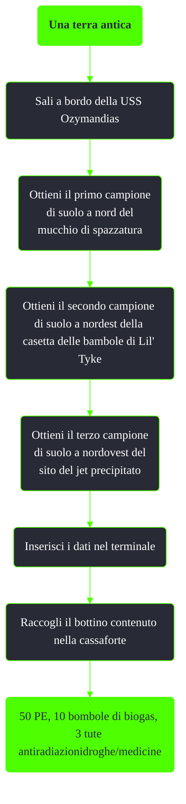

---
# Title, summary, and page position.
linktitle: Una terra antica
summary: ""
weight: 10
icon: message-question
icon_pack: fas

# Page metadata.
title: Una terra antica
date: 2022-11-15
type: book # Do not modify.
commentable: true
tags: "Missioni di Point Lookout"
hidden: true # Visibile nella sidebar
private: false # Nascosto dalle ricerche
---

*Una terra antica* è una missione secondaria del DLC *Point Lookout* di Fallout 3. 

<section class="chart-collapse">
<input type="checkbox" name="collapse2" id="handle2">
<h3 class="handle">
<label for="handle2">Clicca per mostrare il diagramma</label>
</h3>

</section>

| Tappe |       Stato        | Descrizione                                    |
|:-----:|:------------------:| ---------------------------------------------- |
|  11   |                    | Recupera lo Studio del suolo 01.               |
|  12   |                    | Recupera lo Studio del suolo 02.               |
|  13   |                    | Recupera lo Studio del suolo 03.               |
|  50   | :white_check_mark: | Inserisci i dati a bordo della nave pattuglia. |

