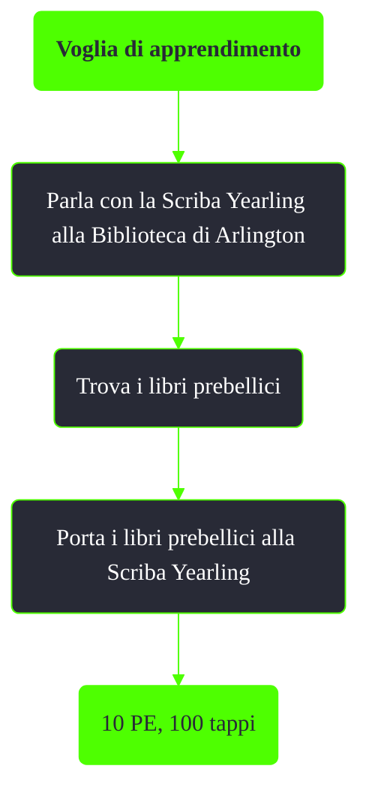

---
# Title, summary, and page position.
linktitle: Voglia di apprendimento
summary: ""
weight: 10
icon: message-question
icon_pack: fas

# Page metadata.
title: Voglia di apprendimento
date: 2022-11-15
type: book # Do not modify.
commentable: true
tags: "Missioni nascoste di Fallout 3"
hidden: true # Visibile nella sidebar
private: false # Nascosto dalle ricerche
---

*Voglia di apprendimento* è una missione nascosta e ripetibile di Fallout 3. È data dalla Scriba Yearling alla Biblioteca di Arlington.

<section class="chart-collapse">
<input type="checkbox" name="collapse2" id="handle2">
<h3 class="handle">
<label for="handle2">Clicca per mostrare il diagramma</label>
</h3>

</section>

**Note**:
- I libri venduti da Wolfgang il Pazzo che vengono considerati 'spazzatura' non sono accettati dalla Scriba Yearling

