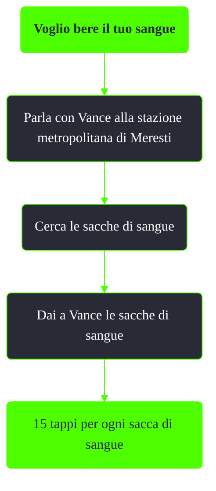

---
# Title, summary, and page position.
linktitle: Voglio bere il tuo sangue
summary: ""
weight: 10
icon: message-question
icon_pack: fas

# Page metadata.
title: Voglio bere il tuo sangue
date: 2022-11-15
type: book # Do not modify.
commentable: true
tags: "Missioni nascoste di Fallout 3"
hidden: true # Visibile nella sidebar
private: false # Nascosto dalle ricerche
---

*Voglio bere il tuo sangue* è una missione nascosta e ripetibile di Fallout 3. È data da Vance alla stazione metropolitana di Meresti.

Note:
- La missione sarà disponibile dopo aver completato, in maniera pacifica *Legami di sangue*
- È possibile avviare questa missione, e guadagnare tappi, anche se durante *Legami di sangue* si è scelto di donare le sacche di sangue