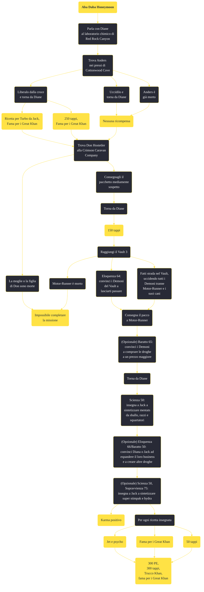

---
# Title, summary, and page position.
linktitle: "Aba Daba Honeymoon"
summary: ""
weight: 10
icon: message-question
icon_pack: fas

# Page metadata.
title: "Aba Daba Honeymoon"
date: 2022-11-15
type: book # Do not modify.
commentable: true
tags: "Missioni secondarie di Fallout: New Vegas"
hidden: true # Visibile nella sidebar
private: false # Nascosto dalle ricerche
---

*Aba Daba Honeymoon* è una missione secondaria di Fallout: New Vegas. È data da Diane al laboratorio chimico di Red Rock.

<section class="chart-collapse">
<input type="checkbox" name="collapse2" id="handle2">
<h3 class="handle">
<label for="handle2">Clicca per mostrare il diagramma</label>
</h3>

</section>

| Tappe |       Stato        | Descrizione                                                                  |
| :---: | :----------------: | ---------------------------------------------------------------------------- |
|  10   |                    | Trova il corriere della droga scomparso di Jack e Diane.                     |
|  15   |                    | Torna da Diane e raccontale di Anders.                                       |
|  20   |                    | Consegna la droga a Motor Runner.                                            |
|  30   |                    | Consegna la droga a Don Hostetler alla Crimson Caravan.                      |
|  40   |                    | Torna da Diane per il tuo pagamento.                                         |
|  50   |                    | Parla con Jack del rifornimento dell'operazione stupefacenti dei Great Khan. |
|  60   | :white_check_mark: | Insegna a Jack nuove ricette di preparazione delle droghe.                   |

**Sfide abilità**:
- **Baratto 65**: per aumentare a 22 tappi il prezzo delle droghe vendute ai Demoni
- **Eloquenza 64**: per scoprire dove si trova Motor-Runner, non appena entrati nel Vault 3
- **Eloquenza 66**/**Baratto 50**: per convincere Jack o Diane ad espandere il proprio traffico di droga
- **Scienza 50**: per insegnare a Jack a creare Mentats da sballo, Razzi, Squartatori e Super Stimpak
- **Sopravvivenza 75**: per insegnare a Jack a creare Idra

**Note**:
- Questa missione apparirà nel Pip-Boy solo dopo aver interagito con Anders 
- Visti i molti bug di questa missione, soprattutto se si sovrappone a *Taglia tre carte* e ad altre missioni del Vault 3, è consigliato non interagire con Motor-Runner prima di iniziare questa missione, poiché il primo dialogo che si ha con lui è l'unico possibile senza rendere ostili tutti gli abitanti del Vault, lui incluso
- Se Motor-Runner è già morto questa missione non può essere completata
- Indossando un'armatura Great Khan è possibile entrare nel Vault e non rendere ostili i Demoni al suo interno
- È possibile uccidere Motor-Runner dopo avergli consegnato il pacchetto e prima di ritornare da Jack e Diane, senza fallire la missione; passando le sfide Eloquenza all'entrata o uccidendolo furtivamente, è possibile evitare di rendere ostili gli altri Demoni 
- Se si ha già iniziato la missione *Taglia tre carte* e parlato con Bryce Anders all'interno del Vault, Motor-Runner inizierà subito il combattimento, anche se il Corriere indossa un'armatura dei Great Khan

