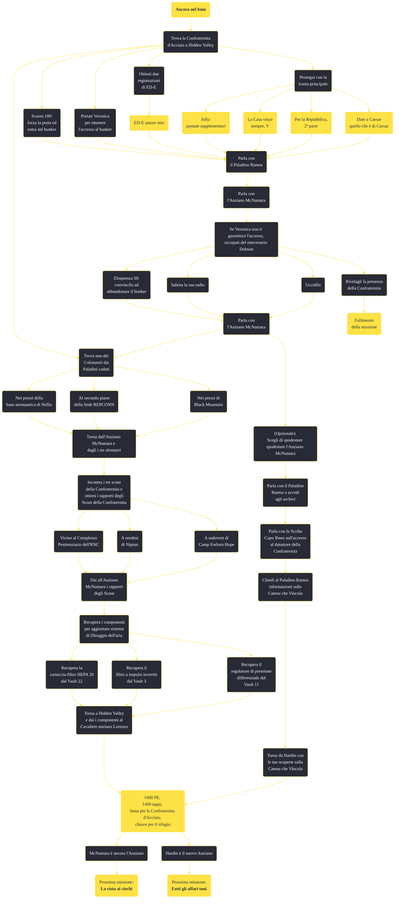

---
# Title, summary, and page position.
linktitle: "Ancora nel buio"
summary: ""
weight: 10
icon: message-question
icon_pack: fas

# Page metadata.
title: "Ancora nel buio"
date: 2022-11-15
type: book # Do not modify.
commentable: true
tags: "Missioni secondarie di Fallout: New Vegas"
hidden: true # Visibile nella sidebar
private: false # Nascosto dalle ricerche
---

*Ancora nel buio* è una missione secondaria di Fallout: New Vegas. È data dall'Anziano McNamara nel bunker di Hidden Valley.

<section class="chart-collapse">
<input type="checkbox" name="collapse2" id="handle2">
<h3 class="handle">
<label for="handle2">Clicca per mostrare il diagramma</label>
</h3>

</section>

| Tappe |       Stato        | Descrizione |
|:-----:|:------------------:| ----------- |
|                           1                           |            | Parla con l'Anziano McNamara.                                                                                                                                               |
|                           5                           |            | Occupati di un mercenario dell'RNC accampato in uno dei bunker di Hidden Valley.                                                                                            |
|                           9                           |            | Torna dall'Anziano McNamara e riferiscigli che ti sei occupato del mercenario.                                                                                              |
|                           15                          |            | Parla con l'Anziano McNamara nella sala di comando.                                                                                                                         |
|                           20                          |            | Trova la pattuglia scomparsa della Confraternita nella sede della REPCONN e recupera l'olonastro della loro missione.                                                       |
|                           21                          |            | Trova la pattuglia scomparsa della Confraternita nella base aeronautica di Nellis e recupera l'olonastro della loro missione.                                               |
|                           22                          |            | Trova la pattuglia scomparsa della Confraternita a Black Mountain e recupera l'olonastro della loro missione.                                                               |
|                           29                          |            | Torna dall'Anziano McNamara con i tre olonastri delle missioni di pattugliamento.                                                                                           |
|                           30                          |            | Incontra uno scout della Confraternita nei pressi del Complesso Penitenziario dell'RNC e raccogli il suo rapporto.                                                          |
|                           31                          |            | Incontra uno scout della Confraternita nei pressi della città di Nipton e raccogli il suo rapporto.                                                                         |
|                           32                          |            | Incontra uno scout della Confraternita nei pressi di Camp Forlorn Hope e raccogli il suo rapporto.                                                                          |
|                           39                          |            | Torna dall'Anziano McNamara con i rapporti dei tre scout.                                                                                                                   |
|                           40                          |            | Parla al Cavaliere anziano Lorenzo in merito al guasto al sistema di filtraggio dell'aria.                                                                                  |
|                           41                          |            | Esamina i Vault della regione alla ricerca di un regolatore di pressione differenziale.                                                                                     |
|                           42                          |            | Esamina i Vault della regione alla ricerca di un filtro a impulsi invertiti.                                                                                                |
|                           43                          |            | Esamina i Vault della regione alla ricerca di varie cartucce-filtro HEPA.                                                                                                   |
|                           48                          |            | Torna dal Cavaliere anziano Lorenzo con i componenti.                                                                                                                       |
|                           49                          | :white_check_mark: | Torna dall'Anziano McNamara per riferirgli che il sistema di filtraggio dell'aria è stato sistemato.                                                                        |
|                           50                          |            | (Opzionale) Aiuta il Paladino Capo Hardin a trovare un modo di destituire l'Anziano McNamara dal suo incarico.                                                              |
|                           51                          |            | (Opzionale) Parla con il Paladino di primo grado Ramos per conto di Hardin.                                                                                                 |
|                           52                          |            | (Opzionale) Esamina i documenti dell'archivio della Confraternita relativi agli anziani allontanati dalla loro posizione.                                                   |
|                           53                          |            | (Opzionale) Chiedi al Paladino Ramos informazioni sulla Catena che Vincola.                                                                                                 |
|                           54                          |            | (Opzionale) Analizza il datastore alla ricerca di informazioni sulla Catena che Vincola.                                                                                    |
|                           55                          |            | (Opzionale) Parla con lo Scriba Capo Ibsen sull'accesso al datastore della Confraternita.                                                                                   |
|                           60                          |            | (Opzionale) Torna da Hardin con i dischi di missione delle pattuglie scomparse.                                                                                             |
|                           61                          |            | (Opzionale) Torna da Hardin con le tue scoperte sulla Catena che Vincola.                                                                                                   |

**Sfide abilità**:
- **Scasso 100**: per forzare l'entrata al bunker della Confraternita
- **Eloquenza 50**: per convincere Dobson a lasciare il bunker abbandonato

**Note**:
- È necessario completare questa missione per poter entrare a far parte della Confraternita o per chiedere alla stessa di allearsi con l'RNC per la battaglia a Hoover Dam
- Completando questa missione, non verrai idolatrato dalla Confraternita a meno che non completi il DLC *Lonesome Road* e fermi i missili dal loro lancio 
- Sostituendo McNamara con Hardin, il Corriere non sarà più in grado di riparare il sistema di filtraggio, se non l'aveva già fatto prima

