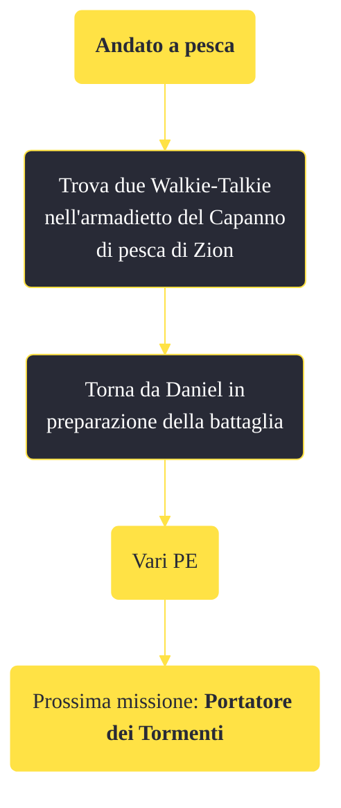

---
# Title, summary, and page position.
linktitle: "Andato a pesca"
summary: ""
weight: 10
icon: message-question
icon_pack: fas

# Page metadata.
title: "Andato a pesca"
date: 2022-11-15
type: book # Do not modify.
commentable: true
tags: "Missioni di Honest Hearts"
hidden: true # Visibile nella sidebar
private: false # Nascosto dalle ricerche
---

*Andato a pesca* è una missione del DLC *Honest Hearts* di Fallout: New Vegas. È data da Joshua Graham all'accampamento dei Cavalli Morti.

**Riassunto**:
1. Trova due Walkie-Talkie nell'armadietto del Capanno di pesca di Zion
2. Torna da Daniel in preparazione della battaglia
3. Ricompensa: **vari PE**
4. Prossima missione: *Portatore dei Tormenti*

<section class="chart-collapse">
<input type="checkbox" name="collapse2" id="handle2">
<h3 class="handle">
<label for="handle2">Clicca per mostrare il diagramma</label>
</h3>

</section>

| Tappe |       Stato        | Descrizione |
|:-----:|:------------------:| ----------- |
|                           10                          |            | Cerca dei walkie-talkie nel capanno di pesca di Zion.                                                                                                                       |
|                           30                          | :white_check_mark: | Trova la chiave dell'armadietto chiuso a chiave nel capanno di pesca di Zion.                                                                                               |

**Sfide abilità**:
- **Scasso 50**: per scassinare l'armadietto con all'interno i walkie-talkie (la chiave è su una scatola nel bagno del capanno di pesca)

