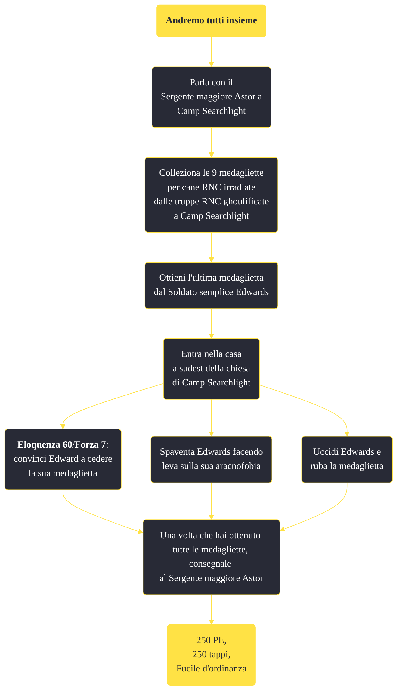

---
# Title, summary, and page position.
linktitle: "Andremo tutti insieme"
summary: ""
weight: 10
icon: message-question
icon_pack: fas

# Page metadata.
title: "Andremo tutti insieme"
date: 2022-11-15
type: book # Do not modify.
commentable: true
tags: "Missioni secondarie di Fallout: New Vegas"
hidden: true # Visibile nella sidebar
private: false # Nascosto dalle ricerche
---

*Andremo tutti insieme* è una missione secondaria di Fallout: New Vegas. È data dal Sergente maggiore Astor a Camp Searchlight.

<section class="chart-collapse">
<input type="checkbox" name="collapse2" id="handle2">
<h3 class="handle">
<label for="handle2">Clicca per mostrare il diagramma</label>
</h3>

</section>

| Tappe |       Stato        | Descrizione |
|:-----:|:------------------:| ----------- |
|                           10                          |            | Raccogli le medagliette di riconoscimento dai soldati ghoul dell'RNC all'interno di Camp Searchlight e portale al Primo Sergente Astor.                                     |
|                           20                          | :white_check_mark: | Hai trovato tutte le medagliette di riconoscimento, torna dal Primo Sergente Astor.                                                                                         |

**Sfide abilità**:
- **Eloquenza 60**/**Forza 7**: per ottenere le medagliette dal Soldato semplice Edwards

**Note**:
- Se non hai ancora convinto Edwards a dargli la medaglietta, prima di avergli suggerito il posto dove scappare, egli abbandonerà la medaglietta sul pavimento della casa in cui si era rifugiato; sebbene l'oggetto sembri di proprietà, prenderlo non farà guadagnare karma negativo
- Non è possibile informare Astor se non dopo che  avrai comunicato ad Edwards che gli scorpioni radioattivi sono stati uccisi 

