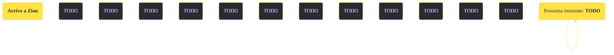

---
# Title, summary, and page position.
linktitle: "Arrivo a Zion"
summary: ""
weight: 10
icon: message-question
icon_pack: fas

# Page metadata.
title: "Arrivo a Zion"
date: 2022-11-15
type: book # Do not modify.
commentable: true
tags: "Missioni di Honest Hearts"
hidden: true # Visibile nella sidebar
private: false # Nascosto dalle ricerche
---

*Arrivo a Zion* è una missione del DLC *Honest Hearts* di Fallout: New Vegas. È data da Jed Masterson arrivando al Canyon Zion.

<section class="chart-collapse">
<input type="checkbox" name="collapse2" id="handle2">
<h3 class="handle">
<label for="handle2">Clicca per mostrare il diagramma</label>
</h3>

</section>

| Tappe |       Stato        | Descrizione |
|:-----:|:------------------:| ----------- |
|                           5                           |            | Segui Jed.                                                                                                                                                                  |
|                           10                          |            | Opzionale: Respingi l'assalto degli Zampabianca.                                                                                                                            |
|                           20                          |            | Recati nella Zion Valley.                                                                                                                                                   |
|                           30                          |            | Recati all'accampamento dei Cavalli Morti sul ramo orientale del Virgin.                                                                                                    |
|                           40                          | :white_check_mark: | Parla con Joshua Graham.                                                                                                                                                    |

**Sfide abilità**:
- **Intelligenza 7**/**Imperialista beffardo**: per sbloccare dei dialoghi unici con i Cavalli Morti

**Note**:
- Le borse da campeggio che si trovano vicine al luogo dell'imboscata possono essere utilizzate per depositare gli oggetti in sicurezza

