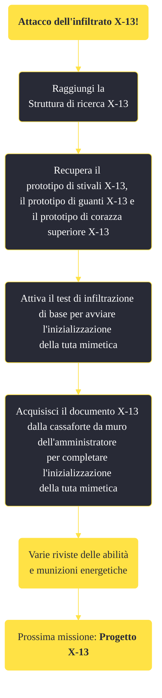

---
# Title, summary, and page position.
linktitle: "Attacco dell'infiltrato X-13!" 
summary: ""
weight: 10
icon: message-question
icon_pack: fas

# Page metadata.
title: "Attacco dell'infiltrato X-13!"
date: 2022-11-15
type: book # Do not modify.
commentable: true
tags: "Missioni di Old World Blues"
hidden: true # Visibile nella sidebar
private: false # Nascosto dalle ricerche
---

*Attacco dell'infiltrato X-13!* è una missione del DLC *Old World Blues* di Fallout: New Vegas. È data dal dottor Klein al Serbatoio del pensiero.

**Riassunto**:
1. Raggiungi la Struttura di ricerca X-13
2. Recupera il prototipo di stivali X-13, il prototipo di guanti X-13 e il prototipo di corazza superiore X-13
3. Attiva il test di infiltrazione di base per avviare l'inizializzazione della tuta mimetica
4. Acquisisci il documento X-13 dalla cassaforte da muro dell'amministratore per completare l'inizializzazione della tuta mimetica
5. Ricompensa: varie **riviste delle abilità** e **munizioni**
6. Prossima missione: *Progetto X-13*

<section class="chart-collapse">
<input type="checkbox" name="collapse2" id="handle2">
<h3 class="handle">
<label for="handle2">Clicca per mostrare il diagramma</label>
</h3>

</section>

| Tappe |       Stato        | Descrizione |
|:-----:|:------------------:| ----------- |
|                           10                          |            | Vai alla Struttura di ricerca X-13.                                                                                                                                         |
|                           20                          |            | Recupera il prototipo di guanti X-13.                                                                                                                                       |
|                           30                          |            | Recupera il prototipo di stivali X-13.                                                                                                                                      |
|                           40                          |            | Recupera il prototipo di corazza superiore X-13.                                                                                                                            |
|                           50                          |            | Attiva il test di infiltrazione di base per avviare l'inizializzazione della tuta mimetica.                                                                                 |
|                           60                          | :white_check_mark: | Acquisisci il documento X-13 dalla cassaforte da muro dell'amministratore per completare l'inizializzazione della tuta mimetica.                                            |

**Note**:
- Dopo aver completato il test e dopo essere usciti dalla struttura, è possibile che appaiano alcuni roboscorpioni

