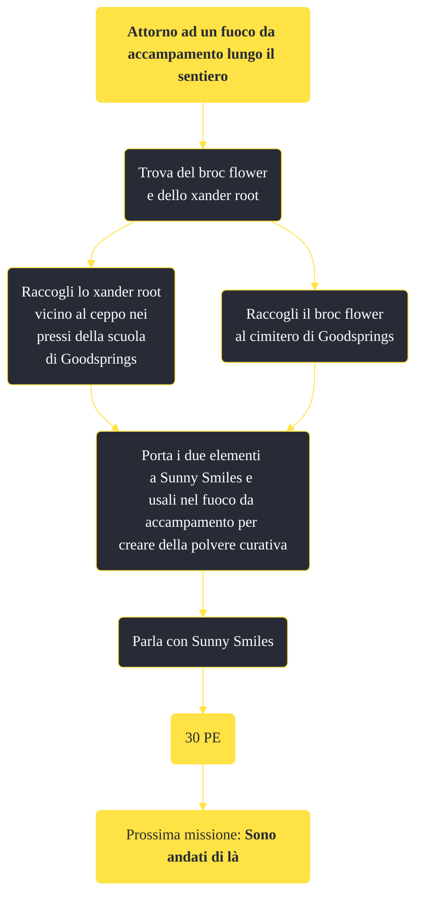

---
# Title, summary, and page position.
linktitle: Attorno ad un fuoco da accampamento lungo il sentiero
summary: ""
weight: 10
icon: message-question
icon_pack: fas

# Page metadata.
title: Attorno ad un fuoco da accampamento lungo il sentiero
date: 2022-11-15
type: book # Do not modify.
commentable: true
tags: "Missioni principali di Fallout: New Vegas"
hidden: true # Visibile nella sidebar
private: false # Nascosto dalle ricerche
---

*Attorno ad un fuoco da accampamento lungo il sentiero* è una missione principale di Fallout: New Vegas. È data da Sunny Smiles a Goodsprings.

<section class="chart-collapse">
<input type="checkbox" name="collapse2" id="handle2">
<h3 class="handle">
<label for="handle2">Clicca per mostrare il diagramma</label>
</h3>

</section>

| Tappe |       Stato        | Descrizione                                                             |
| :---: | :----------------: | ----------------------------------------------------------------------- |
|  10   |                    | Trova un Broc Flower e una Xander Root.                                 |
|  20   |                    | Porta il Broc Flower e la Xander Root a Sunny al fuoco da accampamento. |
|  30   |                    | Usa il fuoco da accampamento per creare della polvere curativa.         |
|  40   | :white_check_mark: | Vai a trovare Trudy al Prospector Saloon.                               |

**Note**:
- Consumare uno dei due elementi prima di finire la missione farà sparire il segnalino di Sunny sulla mappa

