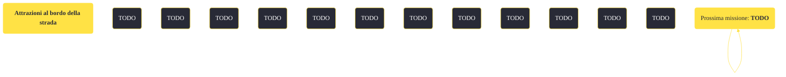

---
# Title, summary, and page position.
linktitle: "Attrazioni al bordo della strada"
summary: ""
weight: 10
icon: message-question
icon_pack: fas

# Page metadata.
title: "Attrazioni al bordo della strada"
date: 2022-11-15
type: book # Do not modify.
commentable: true
tags: "Missioni di Honest Hearts"
hidden: true # Visibile nella sidebar
private: false # Nascosto dalle ricerche
---

*Attrazioni al bordo della strada* è una missione del DLC *Honest Hearts* di Fallout: New Vegas. È data da Joshua Graham all'accampamento dei Cavalli Morti.

<section class="chart-collapse">
<input type="checkbox" name="collapse2" id="handle2">
<h3 class="handle">
<label for="handle2">Clicca per mostrare il diagramma</label>
</h3>

</section>

| Tappe |       Stato        | Descrizione |
|:-----:|:------------------:| ----------- |
|                           5                           |            | Opzionale: Chiedi a Fiutagesso di farti da guida.                                                                                                                           |
|                           10                          |            | Cerca una bussola fra i rottami dell'autobus degli scout.                                                                                                                   |
|                           20                          | :white_check_mark: | Ripara la bussola rotta presso un banco da lavoro.                                                                                                                          |
|                           30                          |            | Opzionale: Trova un modulo sensore per riparare la bussola.                                                                                                                 |
|                           40                          |            | Porta la bussola a Daniel nelle Gole.                                                                                                                                       |
|                           50                          | :white_check_mark: | Ripara la bussola rotta col modulo sensore.                                                                                                                                 |

**Sfide abilità**:
- **Riparazione 30**: per riparare la bussola senza modulo sensore o un banco da lavoro

**Note**:
- Riparando la bussola prima di recuperare il modulo, farà rimanere questo permanentemente nell'inventario

