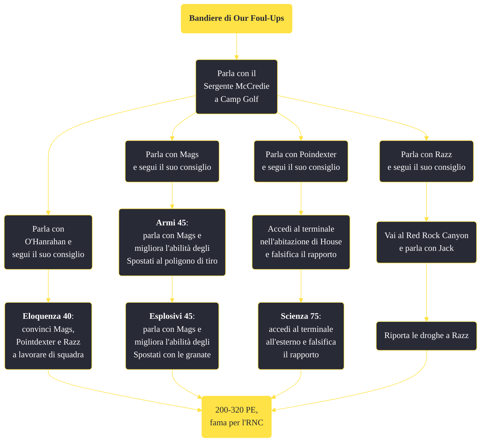

---
# Title, summary, and page position.
linktitle: "Bandiere di Our Foul-Ups"
summary: ""
weight: 10
icon: message-question
icon_pack: fas

# Page metadata.
title: "Bandiere di Our Foul-Ups"
date: 2022-11-15
type: book # Do not modify.
commentable: true
tags: "Missioni secondarie di Fallout: New Vegas"
hidden: true # Visibile nella sidebar
private: false # Nascosto dalle ricerche
---

*Bandiere di Our Foul-Ups* è una missione secondaria di Fallout: New Vegas. È data dal Sergente McCredie a Camp Golf.

**Riassunto**:
1. Parla con il Sergente McCredie a Camp Golf
   - Parla con O'Hanrahan e segui il suo consiglio
      - **Eloquenza 40**: convinci Mags, Pointdexter e Razz a lavorare di squadra
   - Parla con Mags e segui il suo consiglio
      - **Armi 45**: parla con Mags e migliora l'abilità degli Spostati al poligono di tiro
      - **Esplosivi 45**: parla con Mags e migliora l'abilità degli Spostati con le granate
   - Parla con Poindexter e segui il suo consiglio
      - Accedi al terminale nell'abitazione di House e falsifica il rapporto
      - **Scienza 75**: accedi al terminale all'esterno e falsifica il rapporto
   - Parla con Razz e segui il suo consiglio
      1.  Vai al Red Rock Canyon e parla con Jack
      2.  Riporta le droghe a Razz
2.

<section class="chart-collapse">
<input type="checkbox" name="collapse2" id="handle2">
<h3 class="handle">
<label for="handle2">Clicca per mostrare il diagramma</label>
</h3>

</section>

| Tappe |       Stato        | Descrizione |
|:-----:|:------------------:| ----------- |
|                           10                          |            | Parla con gli Spostati del miglioramento della loro squadra.                                                                                                                |
|                           15                          |            | Convinci gli Spostati a lavorare insieme.                                                                                                                                   |
|                           16                          |            | Torna da O'Hanrahan.                                                                                                                                                        |
|                           17                          |            | Procurati droghe da Jack al Red Rock Canyon.                                                                                                                                |
|                           18                          |            | Riporta le droghe a Razz.                                                                                                                                                   |
|                           20                          |            | Aiuta gli Spostati a migliorare le loro abilità di sparo.                                                                                                                   |
|                           25                          |            | Parla con Mags degli ulteriori miglioramenti.                                                                                                                               |
|                           30                          |            | Falsifica i rapporti sulla preparazione degli Spostati.                                                                                                                     |
|                           40                          |            | Aiuta gli Spostati a migliorare le loro abilità di lancio granate.                                                                                                          |
|                           45                          |            | Parla con Mags della preparazione della squadra.                                                                                                                            |
|                           55                          |            | Torna da Poindexter e riferiscigli dei registri modificati.                                                                                                                 |
|                           65                          | :white_check_mark: | Parla con il Sergente McCredie del miglioramento degli Spostati.                                                                                                            |
|                           66                          |            | Convinci Mags a rispettare la squadra e a collaborare con loro.                                                                                                             |
|                           67                          |            | Convinci Razz a rispettare la squadra e a collaborare con loro.                                                                                                             |
|                           68                          |            | Convinci Poindexter a rispettare la squadra e a collaborare con loro.                                                                                                       |

**Sfide abilità**:
- **Eloquenza 40**: per convincere gli Spostati a lavorare in squadra 
- **Armi 45** e **Esplosivi 45**: per migliorare le abilità degli spostati 
- **Scienza 75**: per falsificare i rapporti 

**Note**:
- Le opzioni di dialogo che sbloccano le varie parti della missione sono spesso presenti nelle scelte già fatte in precedenza; il giocatore è molto probabile che dovrà ripetere i medesimi dialoghi più volte per andare avanti con la missione 
- Quando si sceglie un percorso di dialoghi, non si può tornare indietro e sceglierne un altro; tuttavia è sempre presente l'opzione di convincere tutti a collaborare, con relative sfide di Eloquenza
È impossibile finire questa missione se, quando è stata già iniziata, si finisce No, non molto, poiché gli Spostati non saranno più disponibili a Camp Golf

