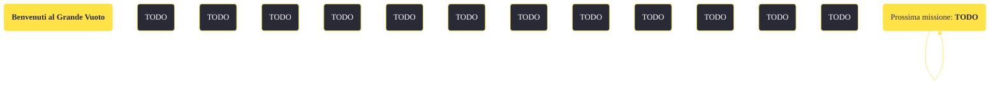

---
# Title, summary, and page position.
linktitle: "Benvenuti al Grande Vuoto" 
summary: ""
weight: 10
icon: message-question
icon_pack: fas

# Page metadata.
title: "Benvenuti al Grande Vuoto"
date: 2022-11-15
type: book # Do not modify.
commentable: true
tags: "Missioni di Old World Blues"
hidden: true # Visibile nella sidebar
private: false # Nascosto dalle ricerche
---

*Benvenuti al Grande Vuoto* è una missione del DLC *Old World Blues* di Fallout: New Vegas. È data dal Pip-Boy al Pozzo.

<section class="chart-collapse">
<input type="checkbox" name="collapse2" id="handle2">
<h3 class="handle">
<label for="handle2">Clicca per mostrare il diagramma</label>
</h3>

</section>

| Tappe |       Stato        | Descrizione |
|:-----:|:------------------:| ----------- |
|                           10                          |            | Scopri dove diavolo sei.                                                                                                                                                    |
|                           20                          |            | Parla ai tuoi... rapitori.                                                                                                                                                  |
|                           30                          |            | Trova l'impianto del cervello del coso dell'X-2, la cosa della colonna vertebrale del coso-proietto-emettitore di onde sonore... e la tuta dal cuore furtivo.               |
|                           40                          |            | Correzione: Hanno il fucile... proiett... emettitore... di onde sonore. Hanno bisogno di una nuova frequenza.                                                               |
|                           50                          |            | Quindi vai a prendere l'impianto del cervello del coso dell'X-2... la nuova frequenza per l'emettitore sonoro e la tuta dal cuore furtivo.                                  |
|                           60                          |            | Aspetta, c'è un'altra frequenza dell'emettitore sonoro opzionale che disattiva i campi di forza che non sono sulla frequenza richiesta...?                                  |
|                           70                          | :white_check_mark: | Chiusura dei registri di ingresso, pulizia della partizione delle utility.                                                                                                  |

**Sfide abilità**:
- **Armi a energia 50**: per ottenere un numero maggiore di munizioni a energia
- **Armi 50**: per ottenere l'Arma Cybercane K9000
- **Armi 75**: per ottenere ulteriori munizioni balistiche
- **Baratto 25**, **50**, **75**, **90**: per ottenere borse mediche, stimpak, tappi e riviste delle abilità

**Note**:
- Non è possibile estrarre alcuna arma mentre sei nel Serbatoio del pensiero

