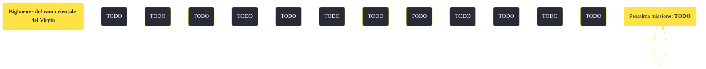

---
# Title, summary, and page position.
linktitle: "Bighorner del ramo orientale del Virgin"
summary: ""
weight: 10
icon: message-question
icon_pack: fas

# Page metadata.
title: "Bighorner del ramo orientale del Virgin"
date: 2022-11-15
type: book # Do not modify.
commentable: true
tags: "Missioni di Honest Hearts"
hidden: true # Visibile nella sidebar
private: false # Nascosto dalle ricerche
---

*Bighorner del ramo orientale del Virgin* è una missione del DLC *Honest Hearts* di Fallout: New Vegas. È data da Fiutagesto.

<section class="chart-collapse">
<input type="checkbox" name="collapse2" id="handle2">
<h3 class="handle">
<label for="handle2">Clicca per mostrare il diagramma</label>
</h3>

</section>

| Tappe |       Stato        | Descrizione |
|:-----:|:------------------:| ----------- |
|                           5                           |            | Trova un modo per risalire le rupi.                                                                                                                                         |
|                           10                          |            | Trova il cucciolo di bighorner di montagna smarrito.                                                                                                                        |
|                           11                          |            | Opzionale: Non uccidere nessun bighorner di montagna.                                                                                                                       |
|                           20                          |            | Fatti seguire dal cucciolo fino ad arrivare da sua madre.                                                                                                                   |
|                           25                          |            | Fatti seguire dal cucciolo fino alla mandria.                                                                                                                               |
|                           26                          |            | Porta il cucciolo a Fiutagesso                                                                                                                                              |
|                           27                          |            | Uccidi tutti i bighorner di montagna.                                                                                                                                       |
|                           30                          | :white_check_mark: | Parla con Fiutagesso                                                                                                                                                        |

**Sfide abilità**:
- A**mico degli animali**: per rendere amichevoli i bighorner

**Note**:
- È utile avere nell'inventario diverse banana yucca, per attirare il cucciolo quando si spaventa

