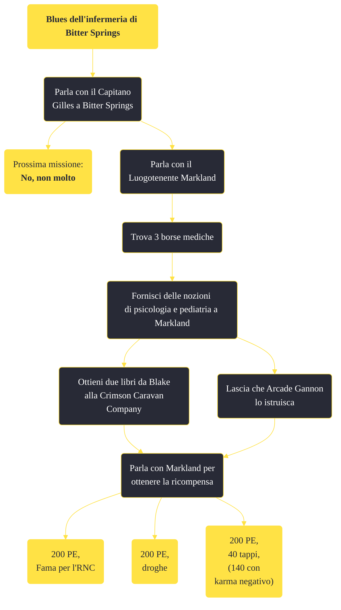

---
# Title, summary, and page position.
linktitle: "Blues dell'infermeria di Bitter Springs"
summary: ""
weight: 10
icon: message-question
icon_pack: fas

# Page metadata.
title: "Blues dell'infermeria di Bitter Springs"
date: 2022-11-15
type: book # Do not modify.
commentable: true
tags: "Missioni secondarie di Fallout: New Vegas"
hidden: true # Visibile nella sidebar
private: false # Nascosto dalle ricerche
---

*Blues dell'infermeria di Bitter Springs* è una missione secondaria di Fallout: New Vegas. È data dal Luogotenente Markland a Bitter Springs.

<section class="chart-collapse">
<input type="checkbox" name="collapse2" id="handle2">
<h3 class="handle">
<label for="handle2">Clicca per mostrare il diagramma</label>
</h3>

</section>

| Tappe |       Stato        | Descrizione |
|:-----:|:------------------:| ----------- |
|                           10                          |            | Parla con il Luogotenente Markland di come migliorare la situazione medica a Bitter Springs.                                                                                |
|                           20                          |            | Procura al Luogotenente Markland un libro di cure psicologiche.                                                                                                             |
|                           30                          |            | Riporta il libro di psicologia al Luogotenente Markland.                                                                                                                    |
|                           40                          |            | Trova un libro di medicina pediatrica per il Luogotenente Markland.                                                                                                         |
|                           50                          |            | Riporta il libro di medicina pediatrica al Luogotenente Markland.                                                                                                           |
|                           60                          | :white_check_mark: | Porta al Luogotenente Markland tre borse da dottore.                                                                                                                        |

**Note**:
- È possibile fallire istantaneamente questa missione hai già svolto *Mi sono dimenticato di ricordarmi di dimenticare* per Boone, poiché durante questa è probabile che Markland finisca per venir ucciso 

