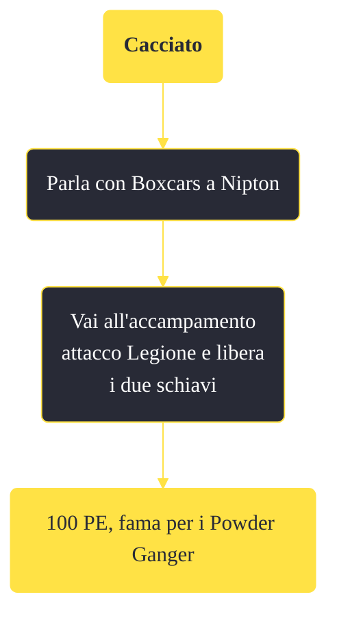

---
# Title, summary, and page position.
linktitle: "Cacciato"
summary: ""
weight: 10
icon: message-question
icon_pack: fas

# Page metadata.
title: "Cacciato"
date: 2022-11-15
type: book # Do not modify.
commentable: true
tags: "Missioni secondarie di Fallout: New Vegas"
hidden: true # Visibile nella sidebar
private: false # Nascosto dalle ricerche
---

*Cacciato* è una missione secondaria di Fallout: New Vegas. È data da Boxcars a Nipton.

<section class="chart-collapse">
<input type="checkbox" name="collapse2" id="handle2">
<h3 class="handle">
<label for="handle2">Clicca per mostrare il diagramma</label>
</h3>

</section>

| Tappe |       Stato        | Descrizione |
|:-----:|:------------------:| ----------- |
|                           25                          | :white_check_mark: | Salva i prigionieri.                                                                                                                                                        |

**Note**:
- Se aspetti troppo nelle vicinanze dell'accampamento, è possibile che i Legionari vengano uccisi da un branco di nightstalker e che i prigionieri fuggano, senza quindi poter completare la missione 
- Questa missione fa parte delle attività che devi compiere per guadagnare la fiducia di Boone e sbloccare *Mi sono dimenticato di ricordarmi di dimenticare*

