---
# Title, summary, and page position.
linktitle: "Che poco ne sappiamo"
summary: ""
weight: 10
icon: message-question
icon_pack: fas

# Page metadata.
title: "Che poco ne sappiamo"
date: 2022-11-15
type: book # Do not modify.
commentable: true
tags: "Missioni secondarie di Fallout: New Vegas"
hidden: true # Visibile nella sidebar
private: false # Nascosto dalle ricerche
---

*Che poco ne sappiamo* è una missione secondaria di Fallout: New Vegas. È data da Cachino o da Joana al Gomorrah sulla Strip.

**Riassunto**:
1. E' possibile ottenere questa missione in modi diversi:
   - Inizia *Per la Repubblica, 2ª parte* e parla con Liza O'Malley all'Ambasciata dell'RNC sulla Strip
   - Inizia *Ciao ciao amore* e ricevi una soffiata da Joana a proposito di Cachino
2. Trova le prova dei traffici illeciti di Cachino
3. Parla con Cachino al Gommorah
4. Ottieni il diario di Cachino
   - Vai dalla receptionist del Gomorrah
      1. Estoricile le informazioni
         - Ottieni la chiave della stanza di Cachino dalla receptionist, pagandola 300 tappi
         -  **Baratto 55**: estorci la chiave della stanza di Cachino dalla receptionist, pagandola 200 tappi
         -  **Forza 8**: intimidisci la receptionist affinché ti dia la chiave della stanza di Cachino
      2. Vai nella stanza di Cachino, al piano delle suite, e ruba il diario all'interno della scrivania
   - Vai allo stripbar del Brimstone, all'interno del Gomorrah, e parla con Cachino
      -  Mostra il diario a Cachino e ricattalo: **100 tappi** (+200 tappi con **Baratto 60**)
      -  Mostra il diario Cachino, ma non darglielo; mostralo invece alla guardia e poi a Big Sal: **100 tappi**, (+20 tappi con **Baratto 55**), *(fallimento) Ciao ciao amore*

Se hai ricattato e ridato il diario a Cachino...
1. Occupati di Clanden e Troike
   -  Parla con Troike, al piano inferiore del Brimstone
       1.  (Opzionale) **Medicina 30**: Digli che la storia della prostituta non quadra
       2.  Liberalo dal contratto con Big Sal o ricattalo
           -  **Eloquenza 53**/**Baratto 45**: convinci Big Sal che Troike è un problema
           -  **Scasso 75**/**Scienza 50**: apri la cassaforte nell'ufficio di Big Sal e prendi la nota di ricatto
               -  Mostra la nota di ricatto a Troike: *impossibile ottenere il Pimp-Boy 3 miliardi*
               -  Consegna la nota al Capitan Marie Pappas all'Ambasciata dell'RNC: *impossibile ottenere il Pimp-Boy 3 miliardi*
           -  **Eloquenza 80**: menti, minacciando di svelare i suoi traffici all'RNC
       3.  (Opzionale) Contatta Mick al Negozio di Mick e Ralph e parlagli del traffico d'armi
       4.  Parla con Cachino
       5.  Decidi di distruggere le armi nel magazzino con la termite
           -  **Eloquenza 70**: convinci Troike a mettere la termite
               1.  Attendi qualche ora fuori dal Gomorrah
               2.  Troike prima di farsi beccare, farà il tuo nome
           -  Prendi la termite e fai saltare in aria il magazzino
       6. Parla con Cachino 
   -  Parla con Clanden al piano delle suite 
       1. Ottieni la chiave della sua cassaforte  
          -  **Scasso 75**: forza la cassaforte dietro l'armadio
          -  Borseggiagli la chiave della cassaforte
       2.  (Opzionale) **Medicina 35**: ispeziona il cadavere della prostituta"
       3.  Prendi i nastri di snuff dalla cassaforte
       4.  Porta i nastri a Cachino
       5.  Confrontati con Claiden
           -  **Baratto 50**: estorcigli **200 tappi** per lasciargli i nastri
           -  Dagli i nastri e convincilo ad andarsene
           -  Tieniti i nastri, rendendolo ostile, e uccidilo
2.  Confrontati con Big Sal e Nero
3.  (Opzionale) **Eloquenza 80**: convinci Cachino a vedersela con i boss
4.  (Opzionale) **Eloquenza 80**: convinci Big Sal a rivelare i piani degli Omerta nel confronto finale e, con una bugia, aizzarlo contro Nero
5.  Uccidi Big Sal e Nero: **300 PE**, **fama per la Strip**, **50 fiches del Gomorrah** (se Cachino sopravvive), possibile fallimento *Date a Caesar quel che è di Caesar*

Se hai ricattato Cachino e dato il diario a Big Sal...
1.  Aiuta Clanden e Troike
   -  Parla con Clanden e aiutalo a creare la bomba al cloro
        -  Acquista il container di cloro da Ralph o da Blake
        -  **Scienza 60**: ottieni gratis il container di cloro da Ralph
        -  Ruba  il container di cloro dall'Ultra-Luxe
   -  Parla con Troike riguardo la spedizioni di armi smontate
        -  Recupera la spedizione di armi smontate
        -  (Opzionale) Contatta Mick al Negozio di Mick e Ralph e chiedigli del traffico d'armi: **Pimp-Boy 3 miliardi** (a fine missione)
2.  Parla con Big Sal: **300 PE**, **400 tappi**, **infamia per la Strip**
3.  (Opzionale, se le chiedi a Big Sal) **50 fiches del Gomorrah**
4.  (Opzionale, se dici a Big Sal di riprendere i traffici con Rick) **Eloquenza 50**: ottieni il **Pimp-Boy 3 miliardi** da Ralph

<section class="chart-collapse">
<input type="checkbox" name="collapse2" id="handle2">
<h3 class="handle">
<label for="handle2">Clicca per mostrare il diagramma</label>
</h3>

</section>

```mermaid
%%{init: {'theme': 'base', 'themeVariables': { 'primaryColor': '#282a36', 'primaryBorderColor': '#ffe245', 'primaryTextColor': '#fff', 'lineColor': '#ffe245', 'fontFamily': 'Jura'}}}%%
graph TD;
    id1(<b>Che poco ne sappiamo</b>):::questfnv
    id2(<b>Per la Repubblica, 2ª parte</b>):::questfnv
    id3(<b>Ciao ciao amore</b>):::questfnv
    id4(Parla con Liza O'Malley <br />all'Ambasciata dell'RNC <br />sulla Strip)
    id5(Ricevi una soffiata <br />da Joana a proposito <br />di Cachino)
    id6(Trova le prova <br />dei traffici illeciti <br />di Cachino)
    id7(Parla con Cachino al Gommorah) 
    id8(Vai dalla receptionist <br />del Gomorrah)
    id9(Vai allo stripbar <br />del Brimstone, all'interno <br />del Gomorrah, e parla <br />con Cachino)
    id10(Ottieni la chiave <br />della stanza di Cachino <br />dalla receptionist, <br />pagandola 300 tappi)
    id11(<b>Baratto 55</b>: <br />estorci la chiave <br />della stanza di Cachino <br />dalla receptionist, <br />pagandola 200 tappi)
    id12(<b>Forza 8</b>: <br />intimidisci la receptionist <br />affinché ti dia la <br />chiave della stanza di Cachino)
    id13(Vai nella stanza di Cachino, <br />al piano delle suite, <br />e ruba il diario <br />all'interno della scrivania)
    id14(Borseggia il diario dal suo inventario)
    id15(Mostra il diario <br />a Cachino e ricattalo)
    id16("Mostra il diario Cachino, <br />ma non darglielo; <br />mostralo invece alla guardia <br />e poi a Big Sal")
    id17("100 tappi <br />(+200 tappi <br />con <b>Baratto 60</b>)"):::rewardfnv
    id18("100 tappi, <br />(+20 tappi <br />con <b>Baratto 55</b>)"):::rewardfnv
    id19(Occupati di <br />Clanden e Troike)
    id20(Aiuta Clanden <br />e Troike)
    id21("(Fallimento) <br />Ciao ciao amore"):::questfnv
    id22(Parla con Troike, <br />al piano inferiore <br />del Brimstone)
    id23(Parla con Clanden <br />al piano delle suite )
    id24("(Opzionale) <b>Medicina 30</b>: <br />Digli che la storia della <br />prostituta non quadra")
    id25(Liberalo dal contratto <br />con Big Sal o ricattalo)
    id26(Borseggiagli la chiave <br />della cassaforte)
    id27(<b>Scasso 75</b>: <br />Forza la cassaforte <br />dietro l'armadio)
    id28(<b>Eloquenza 53</b>/<b>Baratto 45</b>: <br />convinci Big Sal che <br />Troike è un problema)
    id29(Torna da Troike)
    id30(Usa la chiave per aprire <br />la stanza bloccata <br />allo stesso piano)
    id31(Prendi i nastri <br />di snuff dalla cassaforte)
    id32("(Opzionale) Contatta Mick <br />al Negozio di Mick e Ralph <br />e parlagli del traffico d'armi")
    id33(<b>Scasso 75</b>/<b>Scienza 50</b>: <br />apri la cassaforte nell'ufficio <br />di Big Sal e prendi la <br />nota di ricatto)
    id34(<b>Eloquenza 80</b>: <br />menti, minacciando di svelare <br />i suoi traffici all'RNC)
    id35("(Opzionale) <b>Medicina 35</b>: <br />ispeziona il cadavere <br />della prostituta")
    id36("(Opzionale, se non <br />prendi la nota di ricatto), <br />Pimp-Boy 3 miliardi da Ralph"):::rewardfnv
    id37(Mostra la nota <br />di ricatto a Troike)
    id38(Consegna la nota al <br />Capitan Marie Pappas <br />all'Ambasciata dell'RNC)
    id39(Porta i nastri a Cachino)
    id40(Impossibile ottenere<br /> il Pimp-Boy 3 miliardi):::rewardfnv
    id41(Confrontati con Claiden)
    id42(Parla con Cachino)
    id43(<b>Baratto 50</b>: <br />estorcigli 200 tappi <br />per lasciargli i nastri)
    id44(Dagli i nastri e <br />convincilo ad andarsene)
    id45(Tieniti i nastri, <br />rendendolo ostile, <br />e uccidilo)
    id46(Decidi di distruggere <br />le armi nel magazzino <br />con la termite)
    id47(Parla con Cachino)
    id48(<b>Eloquenza 70</b>: <br />convinci Troike a mettere <br />la termite)
    id49(Prendi la termite <br />e fai saltare in <br />aria il magazzino)
    id50(Attendi qualche <br />ora fuori dal Gomorrah)
    id51(Troike prima di <br />farsi beccare, farà il <br />tuo nome)
    id52(Confrontati con <br />Big Sal e Nero)
    id53("(Opzionale) <b>Eloquenza 80</b>: <br />convinci Cachino a <br />vedersela con i boss")
    id54("(Opzionale) <b>Eloquenza 80</b>: <br />convinci Big Sal a <br />rivelare i piani degli Omerta <br />nel confronto finale e, <br />con una bugia, aizzarlo <br />contro Nero")
    id55(Uccidi Big Sal e Nero)
    id56(300 PE, <br />Fama per la Strip):::rewardfnv
    id57("(Possibile fallimento) <br />Date a Caesar quel che è di Caesar"):::questfnv
    id58("(Opzionale, se Cachino sopravvive) <br />50 fiches del Gomorrah"):::rewardfnv
    id59(Parla con Clanden e <br />aiutalo a creare la <br />bomba al cloro)
    id60(Parla con Troike <br />riguardo la spedizioni <br />di armi smontate)
    id61(Acquista il container <br />di cloro da Ralph <br />o da Blake)
    id62(<b>Scienza 60</b>: <br />ottieni gratis il <br />container di cloro <br />da Ralph)
    id63(Ruba  il container <br />di cloro dall'Ultra-Luxe)
    id64(Recupera la spedizione <br />di armi smontate)
    id65(Torna da Clanden)
    id66(Torna da  Troike)
    id67("(Opzionale) Contatta Mick <br />al Negozio di Mick e Ralph <br />e chiedigli del <br />traffico d'armi")
    id68(Parla con Big Sal)
    id69(300 PE, <br />400 tappi, <br />Infamia per la Strip):::rewardfnv
    id70("(Opzionale, se le chiedi <br />a Big Sal) <br />50 fiches del Gomorrah"):::rewardfnv
    id71("(Opzionale, se dici <br />a Big Sal di riprendere <br />i traffici con Rick) <br /><b>Eloquenza 50</b>: <br />ottieni il Pimp-Boy 3 miliardi <br />da Ralph"):::rewardfnv
    id72("Ottieni il Pimp-Boy 3 miliardi <br />(a fine missione)"):::rewardfnv

    id1-->id2 & id3
    id2-->id4
    id3-->id5-->id6-->id7-->id8 & id9
    id8-->id10 & id11 & id12-->id13
    id9-->id14

    id13 & id14-->id15 & id16
    id15-->id17-->id19
    id16-->id18-->id21-->id20

    id19-->id22 & id23
    id22-->id24-->id28-->id29-->id32-->id36-->id42-->id46-->id48 & id49
    id48-->id50-->id51-->id47
    id49-->id47

    id22-->id25-->id28
    id25-->id33 & id34
    id34-->id42
    id33-->id37 & id38-->id40-->id42

    id23-->id26 & id27-->id30 & id31
    id30-->id35-->id31-->id39-->id41-->id43 & id44 & id45
    id43-->id44-->id47-->id52
    id45-->id52-->id53-->id54-->id55-->id56-->id57 & id58
    
    id20-->id59 & id60
    id59-->id61 & id62 & id63-->id65
    id60-->id64-->id66
    id64 & id66-->id67-->id72-->id68-->id69---->id70 & id71
    id64 & id65---->id68
    
    
    click id2 "../per-la-repubblica-2a-parte"
    click id3 "../ciao-ciao-amore"
    
    
    
    
    
    classDef rewardfnv fill:#ffe245, stroke:#ffe245, color:#282a36;
    classDef questfnv fill:#ffe245, stroke:#ffe245, color:#282a36;
```

| Tappe |       Stato        | Descrizione |
|:-----:|:------------------:| ----------- |
|                           1                           |            | Parla al receptionist di Gomorrah delle attività degli Omerta.                                                                                                              |
|                           5                           |            | Parla con Cachino a Gomorrah per Mick. Qualcuno al casinò dovrebbe sapere come contattarlo.                                                                                 |
|                           10                          |            | Parla con Cachino delle attività sospette di Omerta, forse qualcuno a Gomorrah saprà come trovarlo.                                                                         |
|                           20                          |            | Perquisisci Cachino o la sua stanza alla ricerca di prove del suo comportamento. Forse qualcuno ha una chiave della sua stanza.                                             |
|                           30                          |            | Nel diario di Cachino dovrebbero esserci abbastanza prove per farlo parlare.                                                                                                |
|                           31                          |            | Nel diario di Cachino ci sono prove del suo tradimento verso la Famiglia. Rivendi il diario a lui o ai suoi capi.                                                           |
|                           32                          |            | Parla con Troike dei misteriosi rifornimenti di armi.                                                                                                                       |
|                           33                          |            | Scopri il tipo di lavoro svolto da Clanden per la Famiglia.                                                                                                                 |
|                           35                          |            | (Opzionale) Comunica a Mick e a Ralp perché gli Omerta hanno smesso di comprare le loro armi.                                                                               |
|                           40                          |            | (Opzionale) Aiuta Mick e Ralph a rimettersi in affari con gli Omerta.                                                                                                       |
|                           45                          |            | Riferisci a Mick e a Ralph che gli Omerta hanno di nuovo fondi sufficienti per acquistare armi da loro.                                                                     |
|                           50                          |            | Qualcosa nella storia di Troike non quadra. Parla con Big Sal o cerca in giro delle prove per scagionarlo.                                                                  |
|                           51                          |            | Troike vorrebbe aiuto per convincere Big Sal a rescindere il contratto.                                                                                                     |
|                           53                          |            | Mostra la prova del ricatto di Big Sal a Troike.                                                                                                                            |
|                           55                          |            | Big Sal ha accettato di rescindere il contratto con Troike. Torna da Troike e comunicagli la buona notizia.                                                                 |
|                           57                          |            | Usa la termite di Troike per distruggere le armi nel magazzino.                                                                                                             |
|                           58                          |            | Troike intende distruggere le armi per me. Dovrei uscire dal casinò per dargli il tempo che gli serve.                                                                      |
|                           60                          |            | Troike a quest'ora avrà avuto tutto il tempo di distruggere le armi. Torna da Cachino e comunicagli la notizia.                                                             |
|                           62                          |            | Torna da Cachino e comunicagli che le armi sono state distrutte.                                                                                                            |
|                           64                          |            | Vai da Cachino e dai capi degli Omerta per incontrarli e farli fuori.                                                                                                       |
|                           66                          |            | Cachino ha accettato di uccidere i capi degli Omerta durante il nostro incontro. Vai da Cachino quando sei pronto.                                                          |
|                           67                          |            | Mostra a Cachino i nastri della cassaforte di Clanden o parlane a Clanden.                                                                                                  |
|                           68                          |            | (Opzionale) Uccidi Clanden                                                                                                                                                  |
|                           69                          |            | (Opzionale) Usa i nastri per convincere Clanden a tradire la Famiglia                                                                                                       |
|                           70                          |            | Clanden è stato sistemato, non potrà più aiutare gli Omerta. Cachino dovrebbe essere informato.                                                                             |
|                           71                          |            | (Opzionale) Manipola i nastri di Clanden per l'RNC per far accusare Clanden di omicidio.                                                                                    |
|                           75                          |            | La guardia alla porta mi ha suggerito di parlare con Big Sal o Nero del diario di Cachino.                                                                                  |
|                           78                          |            | Partecipa all'incontro di affari di Cachino con Big Sal.                                                                                                                    |
|                           80                          |            | Partecipa all'incontro di affari di Cachino con Nero.                                                                                                                       |
|                           81                          |            | Cachino è morto, parla con il capo delle prossime mosse.                                                                                                                    |
|                           85                          |            | Parla con Troike per capire in che modo puoi aiutarlo.                                                                                                                      |
|                           88                          |            | Parla con Clanden per capire di che tipo di aiuto ha bisogno.                                                                                                               |
|                           90                          |            | Porta il cloro a Clanden. Controlla vicino alla piscina all'Ultra-Luxe o scopri da chi provengono i rifornimenti.                                                           |
|                           95                          |            | Recupera un carico rubato di parti per armi dai Demoni.                                                                                                                     |
|                          100                          |            | Comunica ai capi che sia Clanden che Troike hanno tutto ciò di cui hanno bisogno.                                                                                           |
|                          110                          | :white_check_mark: | Gli Omerta sono nemici e non accetteranno più il tuo aiuto. I capi sopravvissuti si sono nascosti.                                                                          |

**Sfide abilità**:
- **Forza 8**/**Baratto 55**: per estorcere la chiave della stanza di Cachino alla receptionist del Gomorrah (a soli 200 tappi)
- **Baratto 50**: per convincere Clanden ad andarsene
- **Baratto 55**: per ottenere 120 tappi consegnando il diario di Cachino a Big Sal
- **Baratto 60**: per estorcere 200 tappi a Cachino
- **Scasso 75**: per scassinare la cassaforte e prendere i nastri senza usare la chiave di Clanden
- **Scasso 100**: per accedere alla stanza nella quale è nascosto il cadavere della prostituta, senza usare la chiave di Clanden
- **Eloquenza 53**/**Baratto 45**: per slegare Troike dal suo contratto con Big Sal
- **Eloquenza 70**: per convincere Troike a usare lui stesso la termite (facendosi però scoprire)
- **Eloquenza 80**: per mentire a Troike, minacciando di rivelare i suoi traffici con gli Omerta all'RNC
- **Eloquenza 80**: per convincere Cachino a vedersela con i boss
- **Eloquenza 80**: per convincere Big Sal a rivelare i piani degli Omerta nel confronto finale e, con una bugia, aizzarlo contro Nero
- **Scienza 60**: per suggerire a Clanden di costruire una bomba al cloro
- **Scienza 60**: per ottenere gratuitamente il contenitore al cloro da Ralph al Negozio di Mick e Ralph
- **Medicina 35**: per ispezionare il cadavere della prostituta, nella stanza bloccata (**Scasso 75**) dello stesso piano delle suites (la chiave di Clanden apre anche questa porta)

**Note**:
- Se si inizia questa missione prima di aver parlato con Liza O'Malley, è probabile che *Per la Repubblica, 2ª parte* non sia ottenibile dal Colonnello Cassandra Moore
- Se si ha intenzione di appoggiare la Legione di Caesar, è consigliato supportare i due boss del Gomorrah e far fuori Cachino, altrimenti i piani degli Omerta (in realtà della Legione) verrebbero compromessi; se si completa la missione favorendo Cachino, Caesar si arrabbierà molto ma è ancora possibile ottenere il suo perdono, solo se si confessa il proprio errore
- Se si completa questa missione prima di *Ciao ciao amore*, questa fallirà o diventerà inottenibile, poiché Joana e Carlitos spariranno dal gioco
- È possibile liberare Troike usando la nota di ricatto nella cassaforte nell'ufficio di Big Sal e mostrarla a quest'ultimo: in questo caso non sarà possibile ottenere il Pimp-Boy 3 miliardi in maniera legittima
- Se si vuole ottenere il Pimp-Boy 3 miliardi, bisogna liberare Troike dal contratto con Big Sal, convincendo quest'ultimo senza usare la nota di ricatto
  - Anche se ci si impossessa della nota e poi si decide di non usarla, non sarà comunque possibile ottenere il Pimp-Boy 3 miliardi. È necessario convincere Big Sal senza ricattarlo e senza avere mai preso la nota
  - Per riceverlo bisognerà andare da Mick al Negozio di Mick e Ralph prima di affrontare i due boss, e chiedergli del traffico d'armi 
- Confrontarsi con Clanden spesso risulterà in un suo attacco; ucciderlo troppo presto può far fallire la missione
- È possibile completare questa missione in modo ""positivo"" e ottenere comunque il Pimp-Boy 3 miliardi: bisogna liberare Troike dal suo contratto e parlare a Big Sal delle armi acquistate da Mick e Ralph prima di ucciderlo a fine missione 

