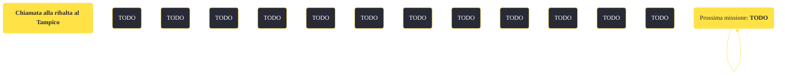

---
# Title, summary, and page position.
linktitle: "Chiamata alla ribalta al Tampico"
summary: ""
weight: 10
icon: message-question
icon_pack: fas

# Page metadata.
title: "Chiamata alla ribalta al Tampico"
date: 2022-11-15
type: book # Do not modify.
commentable: true
tags: "Missioni di Dead Money"
hidden: true # Visibile nella sidebar
private: false # Nascosto dalle ricerche
---

*Chiamata alla ribalta al Tampico* è una missione del DLC *Dead Money* di Fallout:New Vegas. È data da Padre Elijah al Tampico, nel Casinò Sierra Madre.

<section class="chart-collapse">
<input type="checkbox" name="collapse2" id="handle2">
<h3 class="handle">
<label for="handle2">Clicca per mostrare il diagramma</label>
</h3>

</section>

| Tappe |       Stato        | Descrizione |
|:-----:|:------------------:| ----------- |
|                           10                          |            | Cerca Dean al teatro Tampico.                                                                                                                                               |
|                           15                          |            | Cerca la chiave del backstage.                                                                                                                                              |
|                           20                          |            | Cerca un modo per disattivare l'ologramma di sicurezza del teatro Tampico.                                                                                                  |
|                           30                          |            | Riproduci l'olonastro di Dean col proiettore del Tampico.                                                                                                                   |
|                           40                          |            | Vai al backstage del Tampico ed occupati di Dean.                                                                                                                           |
|                           50                          |            | Uccidi Dean Domino.                                                                                                                                                         |
|                           60                          | :white_check_mark: | Scappa dal Tampico prima che il collare di Dean esploda.                                                                                                                    |

**Sfide abilità**:
- **Eloquenza 75**: per convicere Dean a cedere la chiave e continuare ad aiutarlo

**Note**:
- Per evitare di dover uccidere Dean, è necessario, la prima volta che lo incontri, accetta di lavorare per lui ed evitare tutti i dialoghi che possano in qualche modo offendere il suo "ego", comprese domande che riguardano il suo collare

