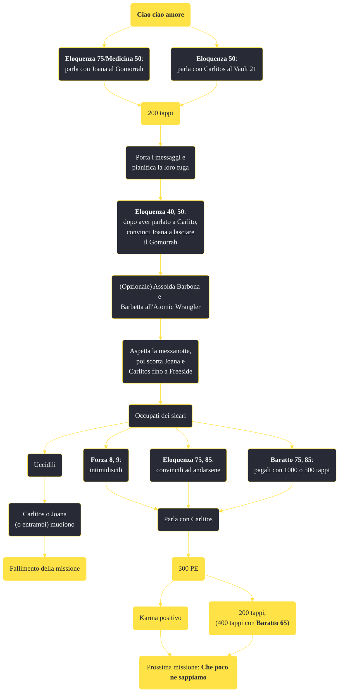

---
# Title, summary, and page position.
linktitle: "Ciao ciao amore"
summary: ""
weight: 10
icon: message-question
icon_pack: fas

# Page metadata.
title: "Ciao ciao amore"
date: 2022-11-15
type: book # Do not modify.
commentable: true
tags: "Missioni secondarie di Fallout: New Vegas"
hidden: true # Visibile nella sidebar
private: false # Nascosto dalle ricerche
---

*Ciao ciao amore* è una missione secondaria di Fallout: New Vegas. È data da Joana al Gomorrah della Strip.

<section class="chart-collapse">
<input type="checkbox" name="collapse2" id="handle2">
<h3 class="handle">
<label for="handle2">Clicca per mostrare il diagramma</label>
</h3>

</section>

| Tappe |       Stato        | Descrizione |
|:-----:|:------------------:| ----------- |
|                           5                           |            | Trova Carlitos per aiutare Joana a fuggire dal Gomorrah.                                                                                                                    |
|                           10                          |            | Parla con Joana al Gomorrah per conto di Carlitos.                                                                                                                          |
|                           20                          |            | Joana ha deciso di restare al Gomorrah per il momento. Riferiscilo a Carlitos.                                                                                              |
|                           30                          |            | Joana ha deciso di fuggire dal Gomorrah. Informa Carlitos della sua decisione.                                                                                              |
|                           40                          |            | Carlitos vuole incontrare Joana a Freeside tra mezzanotte e l'alba. Spiega il piano a Joana.                                                                                |
|                           50                          |            | (Opzionale) Carlitos consiglia di ottenere rinforzi prima di tentare la fuga. Trova i due killer che gli devono un favore.                                                  |
|                           60                          |            | Joana ha accettato il piano di Carlitos. Parla con lei quando sarai pronto a scortarla durante la fuga.                                                                     |
|                           65                          |            | Joana aspetterà camuffata all'ingresso del Gomorrah. Vai lì e conduci le ragazze a Freeside.                                                                                |
|                           66                          |            | Aiuta Joana, e le ragazze, nella loro fuga da Freeside.                                                                                                                     |
|                           70                          |            | L'aiuto di due tiratori professionisti è assicurato. Questo garantirà una maggiore sicurezza durante la fuga.                                                               |
|                           80                          |            | Ho deciso di riferire a Cachino che Joana intende scappare. Vuole che impieghi i killer contro Carlitos durante l'incontro.                                                 |
|                           90                          |            | Joana è stata consegnata a Carlitos sana e salva. Gli Omerta che ci avevano teso un'imboscata sono storia vecchia.                                                          |
|                          100                          | :white_check_mark: | Joana è libera e si è ricongiunta a Carlitos. Ha parlato di una losca operazione degli Omerta.                                                                              |
|                          110                          |   ❌  | Joana è morta. Non potrai più aiutare Carlitos a riabbracciarla.                                                                                                            |
|                          120                          |   ❌  | Carlitos è morto e non si ricongiungerà mai più con Joana.                                                                                                                  |
|                          130                          |   ❌  | Joana è stata lasciata da sola nel suo tentativo di fuga dal Gomorrah.                                                                                                      |
|                          150                          |   ❌  | Joana è morta. Non potrai più aiutarla.                                                                                                                                     |
|                          170                          |   ❌  | Carlitos è morto. Non potrai più aiutarlo.                                                                                                                                  |

**Sfide abilità**:
- **Eloquenza 50**: per parlare con Carlitos di Joana
- **Eloquenza 40**, **50**: per convincere Joana ad andarsene dal Gomorrah e che il Corriere si occuperà degli Omerta
- **Eloquenza 75**/**Medicina 50**/**Cherchez La Femme**: per convincere Joana a parlare di Carlitos e Cachino
- **Eloquenza 75**/**85**, **Baratto 75**/**85**, **Forza 8**/**9**: per evitare lo scontro a fuoco (per la sfida **Baratto 75** sono necessari 1000 tappi, per quella **Baratto 85** solo 500)
- **Baratto 65**: per ottenere 200 tappi aggiuntivi da Carlitos a fine missione

**Note**:
- Non è possibile completare questa missione senza superare almeno una sfida **Eloquenza**/**Medicina 50**
- Carlitos e Joana devono sopravvivere entrambi per completare la missione
- Completando *Che poco ne sappiamo* farà fallire istantaneamente questa missione
- Uccidere un qualsiasi membro degli Omerta potrebbe non rendere completabile la missione, poiché Joanna potrebbe diventare ostile 

