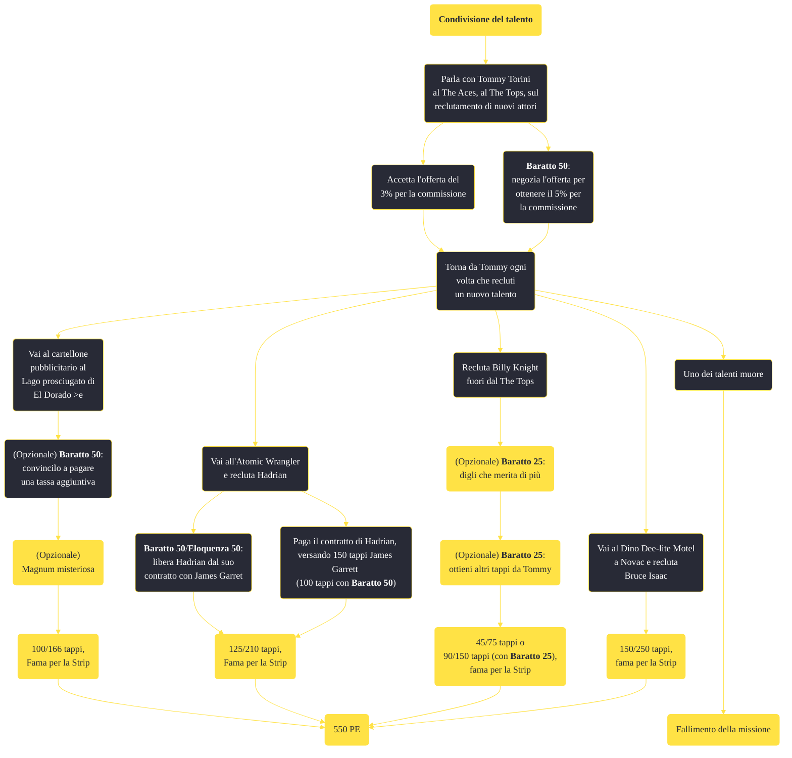

---
# Title, summary, and page position.
linktitle: "Condivisione del talento"
summary: ""
weight: 10
icon: message-question
icon_pack: fas

# Page metadata.
title: "Condivisione del talento"
date: 2022-11-15
type: book # Do not modify.
commentable: true
tags: "Missioni secondarie di Fallout: New Vegas"
hidden: true # Visibile nella sidebar
private: false # Nascosto dalle ricerche
---

*Condivisione del talento* è una missione secondaria di Fallout: New Vegas. È data da Tommy Torini al The Tops.

**Riassunto**:
1. Parla con Tommy Torini al The Aces, al The Tops, sul reclutamento di nuovi attori
   - Accetta l'offerta del 3% per la commissione
   - **Baratto 50**: negozia l'offerta per ottenere il 5% per la commissione
2. Torna da Tommy ogni volta che recluti un nuovo talento
   - Vai al cartellone pubblicitario al Lago prosciugato di El Dorado e recluta Il solitario
      -  (Opzionale) **Baratto 50**: convincilo a pagare una tassa aggiuntiva
      -  Ricompensa: **100/166 tappi**, **fama per la Strip**, (opzionale) **Magnum misteriosa**
   - Vai all'Atomic Wrangler e recluta Hadrian
      -  **Baratto 50**/**Eloquenza 50**: libera Hadrian dal suo contratto con James Garret
      -  Paga il contratto di Hadrian, versando 150 tappi James Garrett (100 tappi con **Baratto 50**)
      -  Ricompensa: **125/210 tappi**, **fama per la Strip**
   - Recluta Billy Knight fuori dal The Tops
      -  (Opzionale) **Baratto 25**: digli che merita di più
      -  (Opzionale) **Baratto 25**: ottieni altri tappi da Tommy
      -  Ricompensa: **45/75 tappi** o **90/150 tappi** (con **Baratto 25**), **fama per la Strip**
   -  Vai al Dino Dee-lite Motel a Novac e recluta Bruce Isaac: **150/250 tappi**, **fama per la Strip**
3. Ricompensa: **550 PE**

<section class="chart-collapse">
<input type="checkbox" name="collapse2" id="handle2">
<h3 class="handle">
<label for="handle2">Clicca per mostrare il diagramma</label>
</h3>

</section>

| Tappe |       Stato        | Descrizione                                                  |
| :---: | :----------------: | ------------------------------------------------------------ |
|  10   |                    | Trova animatori per il Tops (ancora 4).                      |
|  20   |                    | Parla con Tommy Torini al Tops.                              |
|  25   |                    | Trova animatori per il Tops (ancora 3).                      |
|  30   |                    | Parla con Tommy Torini al Tops.                              |
|  35   |                    | Trova animatori per il Tops (ancora 2).                      |
|  40   |                    | Parla con Tommy Torini al Tops.                              |
|  45   |                    | Trova animatori per il Tops (ancora 1).                      |
|  65   |                    | Convinci James Garret a rescindere il contratto con Hadrian. |
|  70   | :white_check_mark: | Riferisci ad Hadrian che hai rescisso il suo contratto.      |

**Sfide abilità**:
- **Baratto 25**: per ottenere fino a 150 tappi da Billy Knight e Tommy Torini
- **Eloquenza 50**/**Baratto 50**: per liberare Hadrian dal suo contratto con James Garret
- **Baratto 50**: per ottenere la Magnum misteriosa dal Solitario
- **Baratto 50**: per ottenere fino al 5% per commissione da Tommy Torini

**Note**:
- Se qualsiasi personaggio da reclutare muore prima di far partire la missione, essa non sarà più ottenibile 

