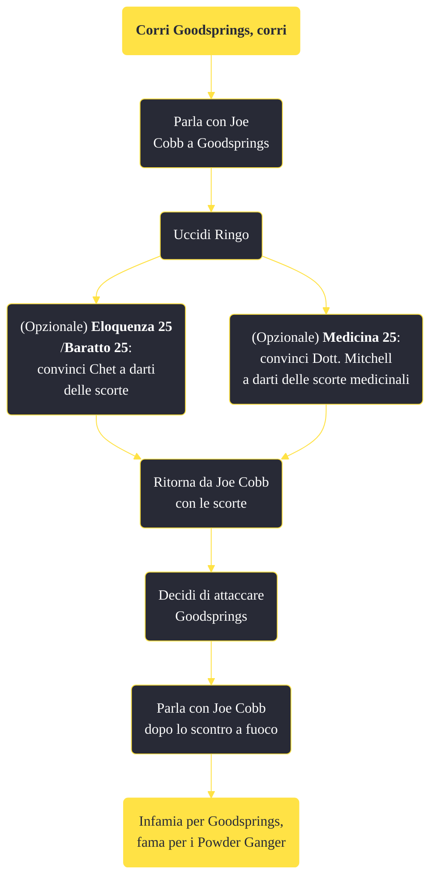

---
# Title, summary, and page position.
linktitle: "Corri Goodsprings, corri"
summary: ""
weight: 10
icon: message-question
icon_pack: fas

# Page metadata.
title: "Corri Goodsprings, corri"
date: 2022-11-15
type: book # Do not modify.
commentable: true
tags: "Missioni secondarie di Fallout: New Vegas"
hidden: true # Visibile nella sidebar
private: false # Nascosto dalle ricerche
---

*Corri Goodsprings, corri* è una missione secondaria di Fallout: New Vegas. È data da Joe Cobb a Goodsprings.

**Riassunto**:
1. Parla con Joe Cobb a Goodsprings
2. Uccidi Ringo
   - (Opzionale) **Eloquenza 25**/**Baratto 25**: convinci Chet a darti delle scorte"
   - (Opzionale) **Medicina 25**: convinci Dott. Mitchell a darti delle scorte medicinali"
3. Ritorna da Joe Cobb con le scorte
4. Decidi di attaccare Goodsprings
5. Parla con Joe Cobb dopo lo scontro a fuoco
6. Ricompensa: **infamia per Goodsprings**, **fama per i Powder Ganger**

<section class="chart-collapse">
<input type="checkbox" name="collapse2" id="handle2">
<h3 class="handle">
<label for="handle2">Clicca per mostrare il diagramma</label>
</h3>

</section>

| Tappe |       Stato        | Descrizione |
|:-----:|:------------------:| ----------- |
|                           10                          |            | Uccidi Ringo.                                                                                                                                                               |
|                           15                          |            | Di' a Joe Cobb che Ringo è morto.                                                                                                                                           |
|                           20                          |            | Programma il tuo attacco a Goodsprings con Joe Cobb.                                                                                                                        |
|                           30                          |            | (Opzionale) Mungi Chet per ottenere delle scorte.                                                                                                                           |
|                           40                          |            | (Opzionale) Ottieni le scorte supplementari di medicinali del Dott. Mitchell per i Powder Ganger.                                                                           |
|                           45                          |            | Consegna le scorte supplementari di medicinali a Joe Cobb.                                                                                                                  |
|                           60                          |            | Comunica a Joe Cobb non appena sei pronto a conquistare Goodsprings.                                                                                                        |
|                           70                          | :white_check_mark: | Sconfiggi la milizia di Goodsprings.                                                                                                                                        |

**Sfide abilità**:
- **Eloquenza 25**/**Baratto 25**: per convincere Chet a consegnare le armature di cuoio
- **Medicina 25**: per convincere il Dott. Mitchell a mettere a disposizione alcune scorte di medicinali

**Note**:
- La ricompensa verrà data anche se Cobb muore, ma non verrà fornito alcun bonus alla reputazione per i Powder Ganger
- Non è possibile iniziare questa missione se hai già iniziato o completato *Scontro a fuoco a Ghost Town*

