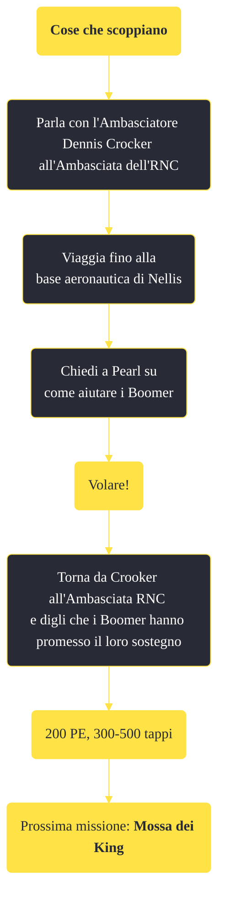

---
# Title, summary, and page position.
linktitle: "Cose che scoppiano"
summary: ""
weight: 10
icon: message-question
icon_pack: fas

# Page metadata.
title: "Cose che scoppiano"
date: 2022-11-15
type: book # Do not modify.
commentable: true
tags: "Missioni principali di Fallout: New Vegas"
hidden: true # Visibile nella sidebar
private: false # Nascosto dalle ricerche
---

*Cose che scoppiano* è una missione principale di Fallout: New Vegas. È data dall'Ambasciatore Dennis Crocker all'Ambasciata dell'RNC.

**Riassunto**:
1. Parla con l'Ambasciatore Dennis Crocker all'Ambasciata dell'RNC
2. Viaggia fino alla base aeronautica di Nellis
3. Chiedi a Pearl su come aiutare i Boomer: *Volare!*
4. Torna da Crooker all'Ambasciata RNC e digli che i Boomer hanno promesso il loro sostegno
5. Ricompensa: **200 PE**, **300-500 tappi**
6. Prossima missione: *Mossa dei King*

<section class="chart-collapse">
<input type="checkbox" name="collapse2" id="handle2">
<h3 class="handle">
<label for="handle2">Clicca per mostrare il diagramma</label>
</h3>

</section>

| Tappe |       Stato        | Descrizione |
|:-----:|:------------------:| ----------- |
|                           5                           |            | L'Ambasciatore Crocker mi ha parlato della missione dei Boomer. Non ho ancora accettato.                                                                                    |
|                           10                          |            | Convinci i Boomer ad aiutarti nella prossima battaglia.                                                                                                                     |
|                           40                          |            | Torna dall'Ambasciatore Crocker e riferiscigli i risultati dell'incontro con i Boomer.                                                                                      |
|                          100                          | :white_check_mark: | Ho detto all'Ambasciatore Crocker che i Boomer ci aiuteranno.                                                                                                               |
|                          102                          |   ❌  | Ho detto all'Ambasciatore Crocker che i Boomer non ci aiuteranno.                                                                                                           |
|                          104                          |   ❌  | L'Ambasciatore Crocker ha scoperto che ho promesso di sostenere i Boomer ed è rimasto deluso.                                                                               |

**Note**:
- È possibile completare questa missione anche se si ha una reputazione bassa con l'RNC ed è possibile entrare nell'Ambasciata senza essere attaccati
- Se si è già idolatrati dai Boomer, questa missione viene saltata
- Accentando questa missione verrà rimossa ogni infamia per l'RNC, anche se si hanno già incontrato i Boomer e ottenuto il loro supporto 

