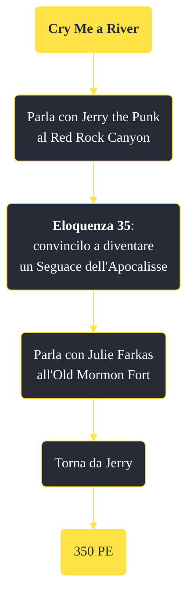

---
# Title, summary, and page position.
linktitle: "Cry Me a River"
summary: ""
weight: 10
icon: message-question
icon_pack: fas

# Page metadata.
title: "Cry Me a River"
date: 2022-11-15
type: book # Do not modify.
commentable: true
tags: "Missioni secondarie di Fallout: New Vegas"
hidden: true # Visibile nella sidebar
private: false # Nascosto dalle ricerche
---

*Cry Me a River* è una missione secondaria di Fallout: New Vegas. È data da Jerry the Punk al Red Rock Canyon.

**Riassunto**:
1. Parla con Jerry the Punk al Red Rock Canyon
2. **Eloquenza 35**: convincilo a diventare un Seguace dell'Apocalisse
3. Parla con Julie Farkas all'Old Mormon Fort
4. Torna da Jerry
5. Ricompensa: **350 PE**

<section class="chart-collapse">
<input type="checkbox" name="collapse2" id="handle2">
<h3 class="handle">
<label for="handle2">Clicca per mostrare il diagramma</label>
</h3>

</section>

| Tappe |       Stato        | Descrizione |
|:-----:|:------------------:| ----------- |
|                           10                          |            | Procura a Jerry the Punk degli antidoloriferi per aiutarlo a superare la sua iniziazione.                                                                                   |
|                           20                          |            | Torna da Jerry the Punk.                                                                                                                                                    |
|                           30                          |            | Parla con i Seguaci dell'Apocalisse della possibile ammissione di Jerry the Punk al loro ordine.                                                                            |
|                           40                          | :white_check_mark: | Di' a Jerry che i Seguaci lo accoglieranno come novizio.                                                                                                                    |

**Sfide abilità**:
- **Eloquenza 35**: per convicere Jerry the Punk a unirsi ai Seguaci dell'Apocalisse

**Note**:
- È consigliato usare il viaggio rapido e attendere un giorno all'Old Mormont Fort per evitare che Jerry rimanga ucciso durante il viaggio, fallendo la missione

