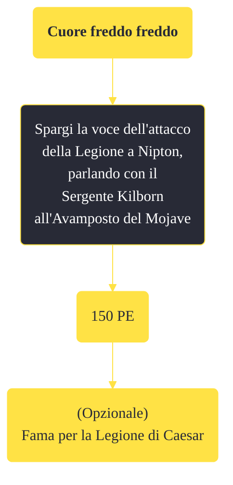

---
# Title, summary, and page position.
linktitle: "Cuore freddo freddo"
summary: ""
weight: 10
icon: message-question
icon_pack: fas

# Page metadata.
title: "Cuore freddo freddo"
date: 2022-11-15
type: book # Do not modify.
commentable: true
tags: "Missioni secondarie di Fallout: New Vegas"
hidden: true # Visibile nella sidebar
private: false # Nascosto dalle ricerche
---

*Cuore freddo freddo* è una missione secondaria di Fallout: New Vegas. È data da Vulpes Inculta a Nipton.

**Riassunto**:
1. Spargi la voce dell'attacco della Legione a Nipton, parlando con il Sergente Kilborn all'Avamposto del Mojave
2. Ricompensa: **150 PE**, (opzionale) **fama per la Legione di Caesar**

<section class="chart-collapse">
<input type="checkbox" name="collapse2" id="handle2">
<h3 class="handle">
<label for="handle2">Clicca per mostrare il diagramma</label>
</h3>

</section>

| Tappe |       Stato        | Descrizione |
|:-----:|:------------------:| ----------- |
|                           10                          |            | Spargi la voce delle atrocità della Legione.                                                                                                                                |
|                           20                          | :white_check_mark: | Hai riferito all'RNC dell'attacco di Vulpes a Nipton.                                                                                                                       |

**Note**:
- Se selezioni l'opzione di dialogo "Sembra che abbiano avuto ciò che meritavano" con Vulpes, guadagnerai fama per la Legione
- La missione fallisce se Vulpes muore: è quindi sconsigliato avere come seguace Boone, poiché egli attaccherà a vista ogni membro della Legione
- Proseguire in *Il dito del sospetto* renderà questa missione non più ottenibile 

