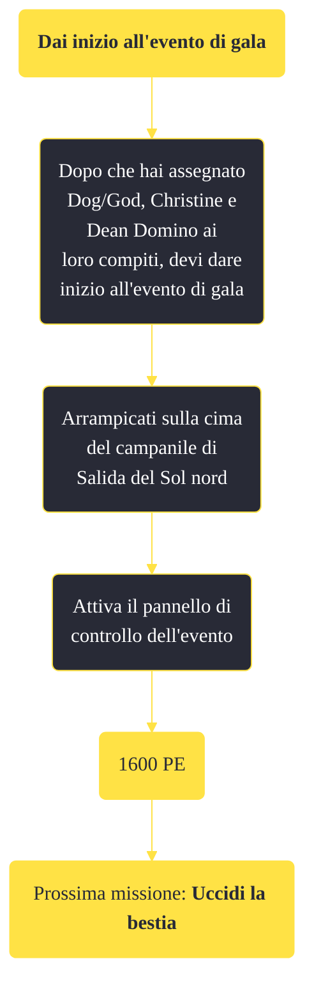

---
# Title, summary, and page position.
linktitle: "Dai inizio all'evento di gala"
summary: ""
weight: 10
icon: message-question
icon_pack: fas

# Page metadata.
title: "Dai inizio all'evento di gala"
date: 2022-11-15
type: book # Do not modify.
commentable: true
tags: "Missioni di Dead Money"
hidden: true # Visibile nella sidebar
private: false # Nascosto dalle ricerche
---

*Dai inizio all'evento di gala* è una missione del DLC *Dead Money* di Fallout:New Vegas. È data da Padre Elijah a Salida del Sol.

<section class="chart-collapse">
<input type="checkbox" name="collapse2" id="handle2">
<h3 class="handle">
<label for="handle2">Clicca per mostrare il diagramma</label>
</h3>

</section>

| Tappe |       Stato        | Descrizione |
|:-----:|:------------------:| ----------- |
|                           10                          |            | Trova il pannello di controllo dell'evento di gala in cima al campanile a Salida del Sol nord e attivalo.                                                                   |
|                           50                          | :white_check_mark: | Vai al cancello principale del Sierra Madre ed entra nel casinò.                                                                                                            |

