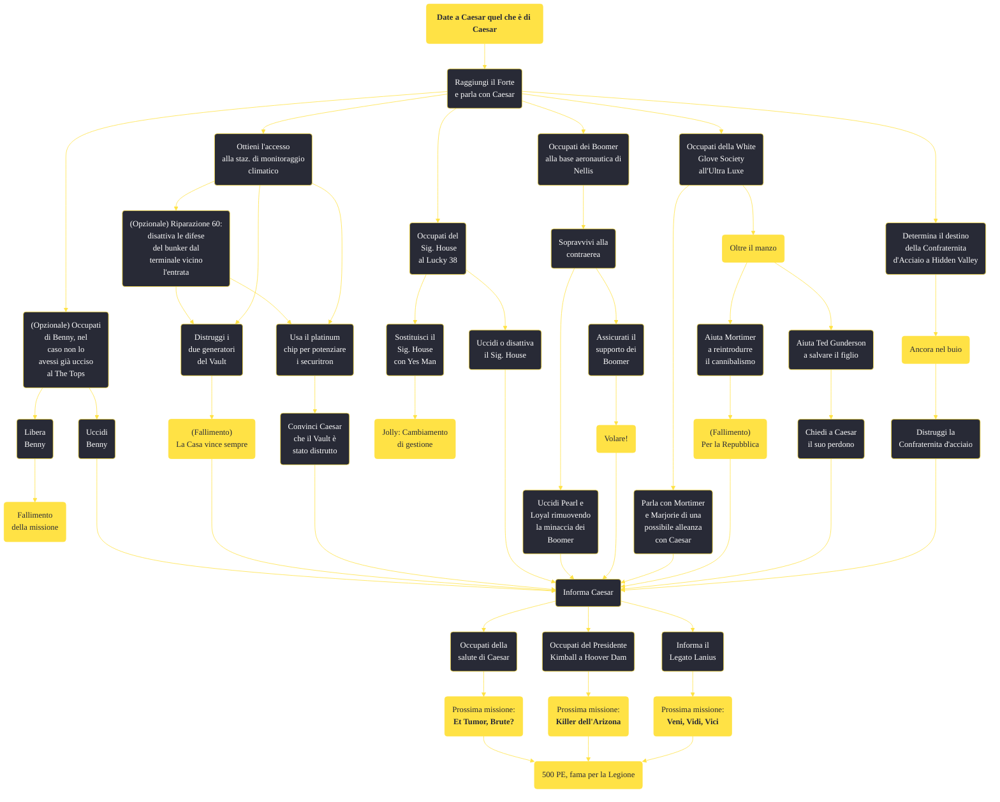

---
# Title, summary, and page position.
linktitle: "Date a Caesar quel che è di Caesar"
summary: ""
weight: 10
icon: message-question
icon_pack: fas

# Page metadata.
title: "Date a Caesar quel che è di Caesar"
date: 2022-11-15
type: book # Do not modify.
commentable: true
tags: "Missioni principali di Fallout: New Vegas"
hidden: true # Visibile nella sidebar
private: false # Nascosto dalle ricerche
---

*Date a Caesar quel che è di Caesar* è una missione principale di Fallout: New Vegas. È data da Caesar al Forte.

<section class="chart-collapse">
<input type="checkbox" name="collapse2" id="handle2">
<h3 class="handle">
<label for="handle2">Clicca per mostrare il diagramma</label>
</h3>

</section>

| Tappe |       Stato        | Descrizione |
|:-----:|:------------------:| ----------- |
|                           1                           |            | Dirigiti a Cottonwood Cove e risali il fiume con la chiatta fino al Forte.                                                                                                  |
|                           2                           |            | Parla con Caesar.                                                                                                                                                           |
|                           3                           |            | Accetta il primo incarico di Caesar.                                                                                                                                        |
|                           5                           |            | Demolisci il bunker del sig. House sotto la stazione climatica.                                                                                                             |
|                           6                           |            | (Opzionale) Inganna Caesar innescando un'esplosione nel Vault senza distruggere la tecnologia del Sig. House.                                                               |
|                           7                           |            | Comunica a Caesar che l'esercito di Securitron non è più una minaccia.                                                                                                      |
|                           8                           |            | Occupati di Benny.                                                                                                                                                          |
|                           9                           |            | Parla con Caesar del prossimo incarico.                                                                                                                                     |
|                           10                          |            | Uccidi il Sig. House.                                                                                                                                                       |
|                           12                          |            | Ottieni la Lucky 38 VIP Keycard.                                                                                                                                            |
|                           15                          |            | Torna da Caesar e comunicagli che il Sig. House è stato neutralizzato.                                                                                                      |
|                           20                          |            | Guadagnati la fiducia dei Boomer e stringi un'alleanza tra loro e la Legione.                                                                                               |
|                           22                          |            | (Opzionale) Uccidi i capi dei Boomer per far sì che non siano più una minaccia per la Legione.                                                                              |
|                           25                          |            | Informa Caesar che i Boomer appoggeranno la Legione contro l'RNC.                                                                                                           |
|                           30                          |            | Informa Caesar che la minaccia dei Boomer è stata neutralizzata.                                                                                                            |
|                           40                          |            | Porta l'offerta di alleanza della Legione a Marjorie della White Glove Society.                                                                                             |
|                           41                          |            | Porta l'offerta di alleanza della Legione a Mortimer della White Glove Society.                                                                                             |
|                           50                          |            | Aiuta Mortimer a convertire la White Glove Society al cannibalismo.                                                                                                         |
|                           53                          |            | Persuadi Marjorie a cambiare idea e a unirsi a Caesar.                                                                                                                      |
|                           55                          |            | Informa Caesar che la White Glove Society è ora un'alleata della Legione.                                                                                                   |
|                           60                          |            | Informa Caesar che la White Glove Society non appoggerà la Legione.                                                                                                         |
|                           70                          |            | Distruggi il bunker della Confraternita d'Acciaio.                                                                                                                          |
|                           75                          |            | Riferisci a Caesar che la minaccia della Confraternita d'Acciaio è stata neutralizzata.                                                                                     |
|                           80                          |            | Riferisci a Caesar che sei riuscito a ottenere il sostegno della Confraternità d'Acciaio contro l'RNC.                                                                      |
|                           85                          |            | Incontra Caesar per una conversazione privata.                                                                                                                              |
|                           90                          |            | Parla con Caesar dopo che sarà stato curato per scoprire il tuo prossimo incarico.                                                                                          |
|                          100                          |            | Torna da Caesar dopo l'assassinio del Presidente Kimball.                                                                                                                   |
|                          101                          |            | Torna da Lucius dopo l'assassinio del Presidente Kimball.                                                                                                                   |
|                          110                          |            | Torna da Caesar per ricevere un riconoscimento per il tuo servizio.                                                                                                         |
|                          111                          |            | Torna da Lucius per ricevere un riconoscimento per il tuo servizio.                                                                                                         |
|                          112                          |            | Torna da Caesar per rispondere del tuo fallimento.                                                                                                                          |
|                          113                          |            | Torna da Lucius per giustificare il tuo fallimento.                                                                                                                         |
|                          114                          |            | Ritorna da Caesar e informalo che la visita del Presidente Kimball è stata cancellata.                                                                                      |
|                          115                          |            | Ritorna da Lucius e informalo che la visita del Presidente Kimball è stata cancellata.                                                                                      |
|                          120                          | :white_check_mark: | Rivolgiti a Legatus Lanius per cominciare la battaglia per Hoover Dam.                                                                                                      |

**Sfide abilità**:
- **Riparazione 60**: per disattivare le difese del bunker

**Note**:
- Questa missione verrà assegnata da Vulpes Inculta (o se questi è morto da Alerio) non appena il Corriere uscirà dal The Tops, completato *Drin drin drin!*. Gli verrà assegnato anche il *Marchio di Caesar*, grazie al quale gli è possibile muoversi nel territorio della Legione senza essere attaccato 

