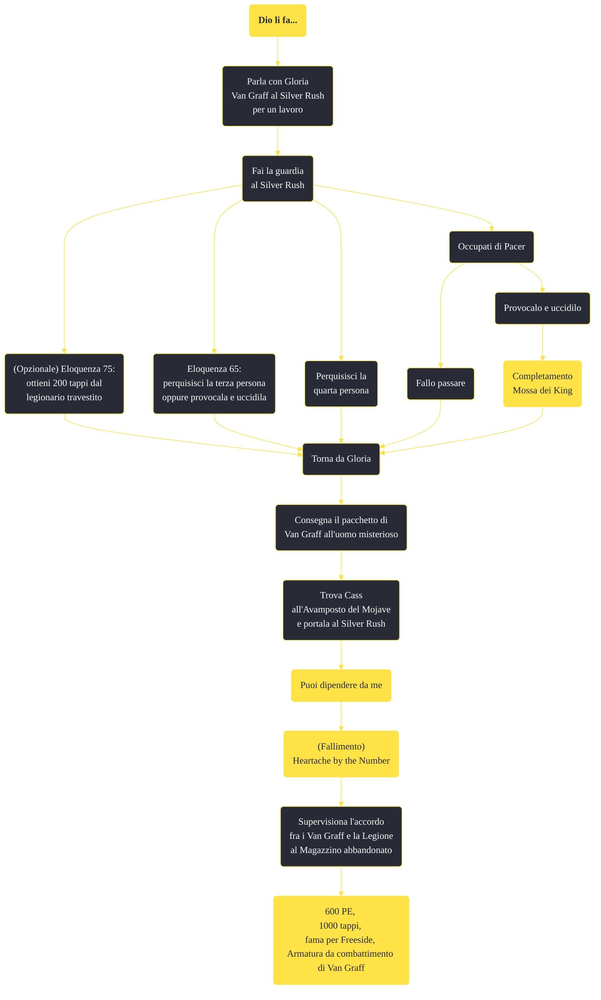

---
# Title, summary, and page position.
linktitle: "Dio li fa..."
summary: ""
weight: 10
icon: message-question
icon_pack: fas

# Page metadata.
title: "Dio li fa..."
date: 2022-11-15
type: book # Do not modify.
commentable: true
tags: "Missioni secondarie di Fallout: New Vegas"
hidden: true # Visibile nella sidebar
private: false # Nascosto dalle ricerche
---

*Dio li fa...* è una missione secondaria di Fallout: New Vegas. È data da Gloria Van Graff o Jean-Baptiste Cutting al Silver Rush di Freeside.

**Riassunto**:
1. Parla con Gloria Van Graff al Silver Rush per un lavoro
2.  Fai la guardia al Silver Rush
   - (Opzionale) **Eloquenza 75**: ottieni 200 tappi dal legionario travestito
   - **Eloquenza 65**: perquisisci la terza persona oppure provocala e uccidila
   -  Perquisisci la quarta persona
3.  Occupati di Pacer
   -  Fallo passare
   -  Provocalo e uccidilo: *Mossa dei King*
4.  Torna da Gloria
5.  Consegna il pacchetto di Van Graff all'uomo misterioso
6. Trova Cass all'Avamposto del Mojave e portala al Silver Rush: *Puoi dipendere da me*, (fallimento) *Heartache by the Number*
7. Supervisiona l'accordo fra i Van Graff e la Legione al Magazzino abbandonato
8. Ricompensa: **600 PE**, **1000 tappi**, **fama per Freeside**, **Armatura da combattimento di Van Graff**

<section class="chart-collapse">
<input type="checkbox" name="collapse2" id="handle2">
<h3 class="handle">
<label for="handle2">Clicca per mostrare il diagramma</label>
</h3>

</section>

| Tappe |       Stato        | Descrizione |
|:-----:|:------------------:| ----------- |
|                           10                          |            | Esci a parlare con Simon.                                                                                                                                                   |
|                           15                          |            | Prendi posizione sul lato opposto dell'ingresso del Silver Rush.                                                                                                            |
|                           20                          |            | Fai la guardia all'ingresso del Silver Rush.                                                                                                                                |
|                           25                          |            | Fai rapporto a Gloria.                                                                                                                                                      |
|                           30                          |            | Consegna il pacchetto a un uomo nel luogo prestabilito.                                                                                                                     |
|                           35                          |            | Comunica a Gloria che il pacchetto è stato consegnato.                                                                                                                      |
|                           36                          |            | Parla con Jean-Baptiste per ricevere il tuo prossimo incarico.                                                                                                              |
|                           40                          |            | Trova Rose of Sharon Cassidy e fai in modo che ti segua.                                                                                                                    |
|                           41                          |            | (Opzionale) Vai a trovare Alice McLafferty: potrebbe sapere dove si trova attualmente Rose of Sharon Cassidy.                                                               |
|                           45                          |            | Porta la giovane Cassidy a Jean-Baptiste.                                                                                                                                   |
|                           46                          |            | Ritorna al Silver Rush a Freeside e racconta a Jeane-Baptiste che Cassidy è morta.                                                                                          |
|                           49                          |            | Rivolgiti a Gloria Van Graff per il tuo prossimo incarico.                                                                                                                  |
|                           50                          |            | Uccidi le truppe della Legione rimaste.                                                                                                                                     |
|                           55                          | :white_check_mark: | Riferisci a Gloria Van Graff che tutte le truppe della Legione sono morte.                                                                                                  |

**Sfide abilità**:
- **Eloquenza 65**: per perquisire la terza persona
- **Eloquenza 75**: per ottenere 200 tappi dal legionario

**Note**:
- Con le ultima patch, completare pacificamente *Heartache by the Number* renderà ostili i Van Graff, rendendo impossibile completarle entrambe nella stessa sessione di gioco
- Se Pacer è già morto prima di iniziare la missione, guadagnerai da Gloria solo 200 tappi, anche se hai trattato bene tutti gli altri clienti 

