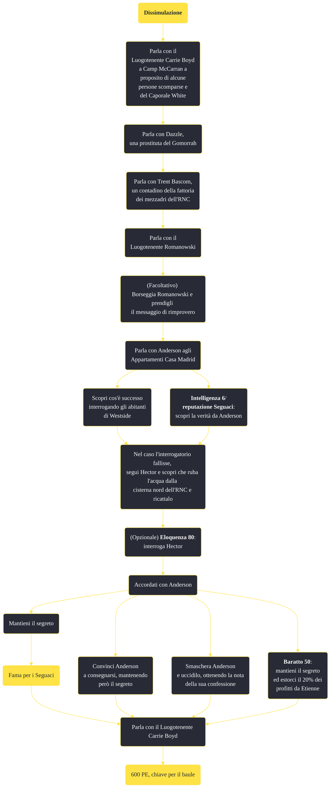

---
# Title, summary, and page position.
linktitle: "Dissimulazione"
summary: ""
weight: 10
icon: message-question
icon_pack: fas

# Page metadata.
title: "Dissimulazione"
date: 2022-11-15
type: book # Do not modify.
commentable: true
tags: "Missioni secondarie di Fallout: New Vegas"
hidden: true # Visibile nella sidebar
private: false # Nascosto dalle ricerche
---

*Dissimulazione* è una missione secondaria di Fallout: New Vegas. È data da Luogotenente Carrie Boyd a Camp McCarran.

<section class="chart-collapse">
<input type="checkbox" name="collapse2" id="handle2">
<h3 class="handle">
<label for="handle2">Clicca per mostrare il diagramma</label>
</h3>

</section>

| Tappe |       Stato        | Descrizione |
|:-----:|:------------------:| ----------- |
|                           5                           |            | (Opzionale) Indaga tra gli effetti personali del Caporale White nel suo armadietto nei pressi del Viale di McCarran.                                                        |
|                           10                          |            | Parla con Dazzle della scomparsa del Caporale White.                                                                                                                        |
|                           20                          |            | Scopri cosa sa Trent Bascom del Caporale White.                                                                                                                             |
|                           30                          |            | Parla con il Luogotenente Romanowski del Caporale White.                                                                                                                    |
|                           40                          |            | Chiedi a Tom Anderson informazioni sul nascondiglio del Caporale White.                                                                                                     |
|                           50                          |            | Cerca qualcuno a Westside che potrebbe aver visto il Caporale White.                                                                                                        |
|                           60                          |            | Segui Hector durante il giorno e scopri dove si procura l'acqua.                                                                                                            |
|                           70                          |            | Parla con Anderson della scomparsa del Caporale White.                                                                                                                      |
|                           75                          |            | Uccidi Anderson.                                                                                                                                                            |
|                           80                          |            | Parla con Etienne per completare il tuo accordo di "affari" con Anderson.                                                                                                   |
|                           90                          | :white_check_mark: | Riferisci al Luogotenente Boyd cosa è successo al Caporale White.                                                                                                           |

**Sfide abilità**:
- **Intelligenza 6**: per convincere Anderson a dire la verità
- **Eloquenza 80**: per confrontarsi con il bambino Hector
- **Baratto 50**: per estorcere il 20% dei profitti da Etienne

**Note**:
- È probabile che tu debba parlare prima con il Colonnello James Hsu a proposito della scomparsa del mercenario Bryce Anders, altrimenti l'opzione di dialogo con Boyd non apparirà. Hsu, durante la missione *Ti ho stregato*, ti dirà di rivolgerti a Boys, sbloccando il dialogo per far iniziare la missione 
- Questa missione fornisce 3 dei 5 punti necessari per sbloccare *Valzer delle candele* di Arcade Gannon
- Boyd non renderà disponibile questa missione attraverso i suoi dialoghi se la missione nascosta che riguarda Silus (*Silus Treatment*) è già stata completata

