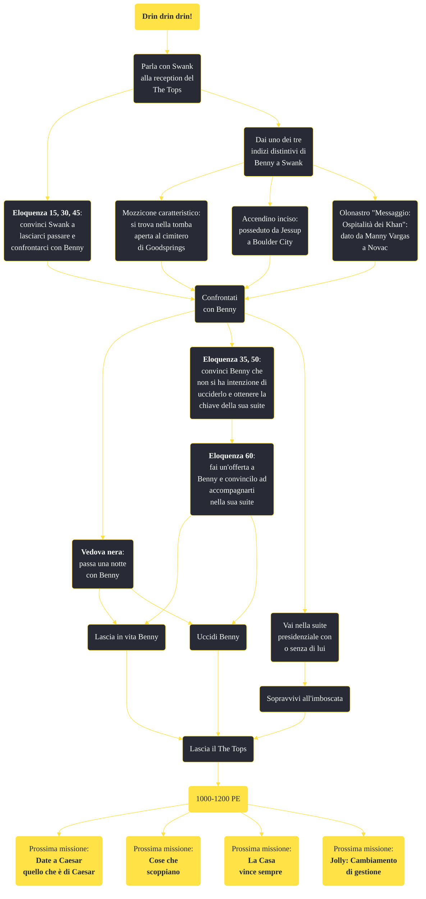

---
# Title, summary, and page position.
linktitle: Drin drin drin!
summary: ""
weight: 10
icon: message-question
icon_pack: fas

# Page metadata.
title: Drin drin drin!
date: 2022-11-15
type: book # Do not modify.
commentable: true
tags: "Missioni principali di Fallout: New Vegas"
hidden: true # Visibile nella sidebar
private: false # Nascosto dalle ricerche
---

*Drin drin drin!* è una missione principale di Fallout: New Vegas. È data da Jessup a The Tops.

<section class="chart-collapse">
<input type="checkbox" name="collapse2" id="handle2">
<h3 class="handle">
<label for="handle2">Clicca per mostrare il diagramma</label>
</h3>

</section>

| Tappe |       Stato        | Descrizione                                                                     |
| :---: | :----------------: | ------------------------------------------------------------------------------- |
|   5   |                    | Perlustra la Strip alla ricerca dell'uomo che ti ha sparato.                    |
|  10   |                    | Parla con Benny al casinò di The Tops.                                          |
|  18   |                    | Uccidi Benny.                                                                   |
|  20   |                    | Vai nella suite presidenziale.                                                  |
|  30   | :white_check_mark: | Sopravvivi all'imboscata.                                                       |
|  40   | :white_check_mark: | Perquisisci la suite di Benny.                                                  |
|  41   |                    | Cerca Benny e il Platinum Chip all'accampamento di Caesar a Fortification Hill. |
|  42   |                    | Uccidi Benny.                                                                   |
|  43   | :white_check_mark: | Recupera il Platinum Chip.                                                      |
|  44   |                    | Trova Benny a Fortification Hill.                                               |
|  55   |                    | [Opzionale] Consegna il chip a Yes-Man.                                         |
|  60   | :white_check_mark: | Perquisisci la stanza di Benny.                                                 |
|  65   | :white_check_mark: | Segui Benny nella sua suite e parla con lui.                                    |

**Sfide abilità**:
- **Eloquenza 15**, **30**, **45**: per convincere Swank al The Tops a distrarre Benny mentre si perquisisce la suite presidenziale
- **Eloquenza 35**, **50**, **60**: per persuadere Benny che non si ha intenzione di ucciderlo
- **Vedova Nera**: per portare a letto Benny
- **Scasso 50**: per aprire la cassaforte a sinistra dell'entrata alla suite di Benny

**Note**:
- Se non lo si uccide al The Tops, Benny verrà catturato dalla Legione e mandato al Forte: lì è possibile eseguire personalmente la sua condanna a morte, lottare nell'arena contro di lui in una sfida all'ultimo sangue o farlo evadere passandogli uno Stealth Boy (con un buono livello di Furtivo)

