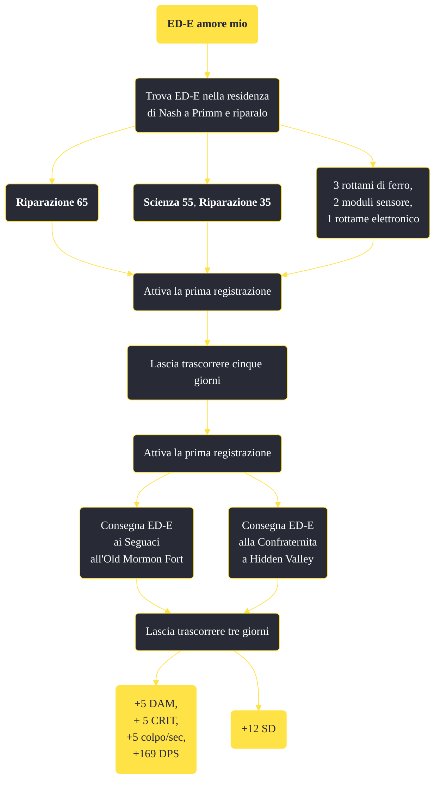

---
# Title, summary, and page position.
linktitle: "ED-E amore mio"
summary: ""
weight: 10
icon: message-question
icon_pack: fas

# Page metadata.
title: "ED-E amore mio"
date: 2022-11-15
type: book # Do not modify.
commentable: true
tags: "Missioni secondarie di Fallout: New Vegas"
hidden: true # Visibile nella sidebar
private: false # Nascosto dalle ricerche
---

*ED-E amore mio* è una missione secondaria di Fallout: New Vegas. È data da ED-E a Primm.

<section class="chart-collapse">
<input type="checkbox" name="collapse2" id="handle2">
<h3 class="handle">
<label for="handle2">Clicca per mostrare il diagramma</label>
</h3>

</section>

| Tappe |       Stato        | Descrizione |
|:-----:|:------------------:| ----------- |
|                           1                           |            | (Opzionale) Porta ED-E al deposito di Gibson a Novac.                                                                                                                       |
|                           5                           |            | Sembrerebbe che ED-E abbia immagazzinato dei dati di registro dell'enclave che vengono attivati mediante parole chiave.                                                     |
|                           7                           |            | I Seguaci dell'Apocalisse vorrebbe vedere ED-E per poter accedere ai dati di registro che ha immagazzinato.                                                                 |
|                           10                          |            | Trova la pattuglia di cui ha parlato il cavaliere Lorenzo per far esaminare ED-E alla Confraternità d'Acciaio.                                                              |
|                           12                          |            | I membri della pattuglia menzionata da Lorenzo sono morti, forse c'è qualcosa di utile addosso a uno dei cadaveri.                                                          |
|                           13                          |            | Uno dei cadaveri della Confraternita aveva una password. Forse potrebbe essere usata per portare ED-E a Lorenzo.                                                            |
|                           15                          |            | Parla col cavaliere Lorenzo a Hidden Valley di ED-E.                                                                                                                        |
|                           20                          |            | Lorenzo vorrebbe esaminare i dati su ED-E. Si è offerto di potenziare l'armatura di ED-E mentre lavora su di lui.                                                           |
|                           25                          |            | Lorenzo sta esaminando ED-E e ne sta migliorando l'armatura. Dovrebbe essere pronto tra qualche giorno.                                                                     |
|                           30                          |            | April Martimer e i Seguaci vorrebbero accedere ai dati di ED-E. Ha promesso di potenziare le sue armi mentre ci lavora su.                                                  |
|                           35                          |            | April ha ED-E e ci lavorerà su per qualche giorno per accedere ai suoi dati e potenziarne le armi.                                                                          |
|                           60                          | :white_check_mark: | I potenziamenti di ED-E sono stati completati.                                                                                                                              |

**Sfide abilità**:
- **Riparazione 65** oppure **Scienza 55** e **Riparazione 35**: per riparare ED-E a Primm senza i materiali di ricambio

**Note**:
- È possibile riparare ED-E con un rottame elettronico, tre rottami di ferro e due moduli sensore (questi materiali sono tutti disponibili presso Radio Lupo Solitario, a sud di Goodsprings)
Per poter attivare la prima registrazione di ED-E è possibile parlare con un certo numero di persone all'interno del gioco:
  - le truppe RNC al di fuori di HELIOS One
  - Dottor Henry a Jacobstown, menzionando il suo passato nell'Enclave
  - Colonnello Cassandra Moore durante la missione *Per la Repubblica, 2ª parte*
  - Ignacio Rivas ad HELIOS One, mentre si fanno riferimenti ad ARCHIMEDES e alla Confraternita d'Acciaio
  - il Cavaliere Torres, quartiermastro dell'armeria della Confraternita d'Acciaio a Hidden Valley
  - il Dottor Thomas Hildern a Camp McCarran
  - Michael Angelo nel suo laboratorio sulla Strip
  - Sig. House, discutendo della Confraternita d'Acciaio
  - l'Apprendista Watkins, nominando HELIOS One
  - il Quartiermaestro Mayes, durante la missione Ripristino di Hope
  - l'Anziana signora Gibson al Mucchio di rottami di Gibson 
- Dopo aver aspettato almeno cinque giorni, è possibile cercare l'attivatore della seconda registrazione, parlando con:
  - l'Anziana signora Gibson al Mucchio di rottami di Gibson (se il Corriere non ci ha già parlato)
  - Colonnello Cassandra Moore durante la missione *Per la Repubblica, 2ª parte*
  - Ignacio Rivas ad HELIOS One, mentre si fanno riferimenti ad ARCHIMEDES e alla Confraternita d'Acciaio
  - Michael Angelo nel suo laboratorio sulla Strip, a proposito della sua mancanza di ispirazione (attivando *Ispirazione classica*)
  - i Paladini e gli Scribi a Hidden Valley, aspettando nel bunker qualche giorno dopo aver completato *Ancora nel buio* o dopo aver sistemato Dobson
  - Veronica, durante la missione *Potrei risvegliare il tuo interesse*, dopo aver ottenuto accesso al terminale di Elijah
  - il Quartiermaestro Mayes, durante la missione *Ripristino di Hope*
  - il Dottor Thomas Hildern a Camp McCarran, durante la missione *Guarda tra l'erba*
  - l'Apprendista Watkins, nominando HELIOS One
  - Dottor Henry a Jacobstown, menzionando il suo passato nell'Enclave
- Consegnando infine ED-E alla Confraternita gli verrà potenziata l'armatura (da 8 SD a 20 SD), mentre consegnandolo ai Seguaci dell'Apocalisse verrà potenziato il suo laser (+5 d. balistico, + 5 CRIT, +5 colpo/sec, +169DPS); dovranno trascorrere almeno 3 giorni per poterlo riprendere a Primm "

