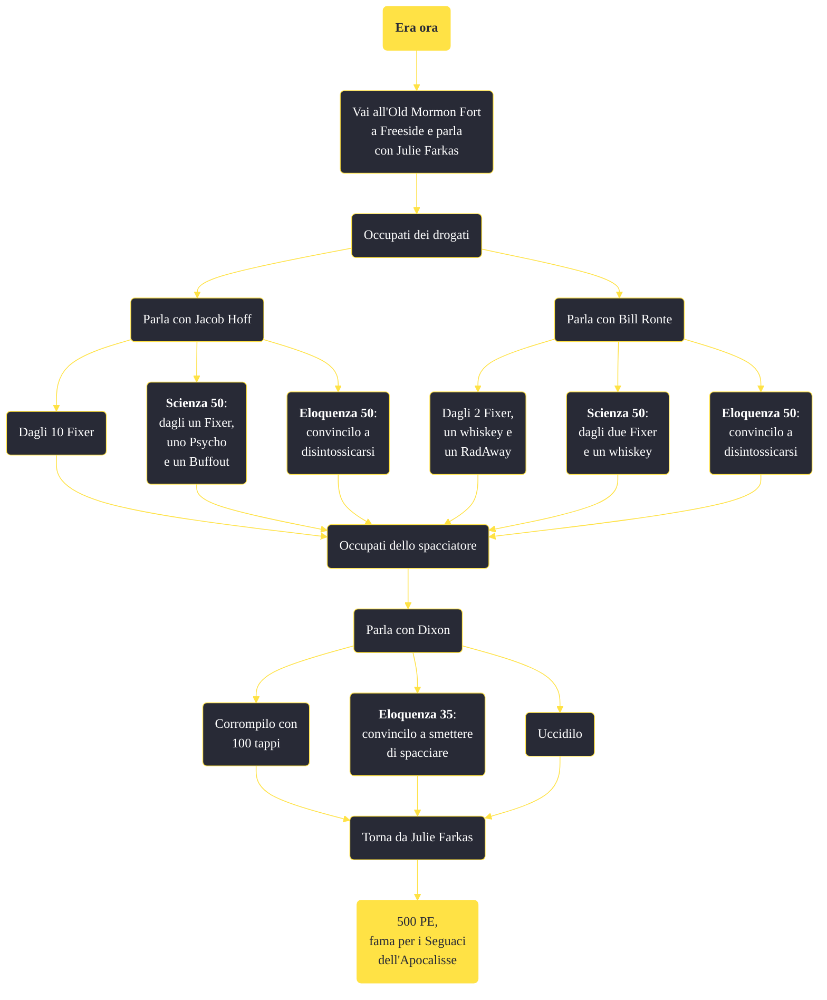

---
# Title, summary, and page position.
linktitle: "Era ora"
summary: ""
weight: 10
icon: message-question
icon_pack: fas

# Page metadata.
title: "Era ora"
date: 2022-11-15
type: book # Do not modify.
commentable: true
tags: "Missioni secondarie di Fallout: New Vegas"
hidden: true # Visibile nella sidebar
private: false # Nascosto dalle ricerche
---

*Era ora* è una missione secondaria di Fallout: New Vegas. È data da Julie Farkas all'Old Mormon Fort di Freeside.

<section class="chart-collapse">
<input type="checkbox" name="collapse2" id="handle2">
<h3 class="handle">
<label for="handle2">Clicca per mostrare il diagramma</label>
</h3>

</section>

| Tappe |       Stato        | Descrizione |
|:-----:|:------------------:| ----------- |
|                           5                           |            | Trova Bill Ronte.                                                                                                                                                           |
|                           10                          |            | Aiuta Bill Ronte con il suo problema di alcolismo.                                                                                                                          |
|                           15                          |            | Trova Jacob Hoff.                                                                                                                                                           |
|                           20                          |            | Aiuta Jacob Hoff a disintossicarsi.                                                                                                                                         |
|                           60                          |            | Occupati dello spacciatore.                                                                                                                                                 |
|                           70                          |            | Procurati due dosi di Fixer, del Rad-Away e una bottiglia di whiskey per Bill.                                                                                              |
|                           75                          |            | (Opzionale) Procurati due dosi di Fixer e una bottiglia di Whiskey per Bill.                                                                                                |
|                           80                          |            | Procurati dieci dosi di Fixer per Jacob.                                                                                                                                    |
|                           85                          |            | (Opzionale) Procurati una dose di Fixer, una di Psycho e una di Buffout per Jacob.                                                                                          |
|                           90                          | :white_check_mark: | Torna da Julie Farkas.                                                                                                                                                      |

**Sfide abilità**:
- **Scienza 50**: per poter dare a Jacob solo un fixer, uno psycho e un buffout
- **Scienza 50**: per poter dare a Bill solo due fixer e del whiske
- **Eloquenza 35**/**Vedova nera**: per convincere Dixo a smettere di spacciare
- **Eloquenza 50**: per convincere Jacop e Bill a disintossicarsi

