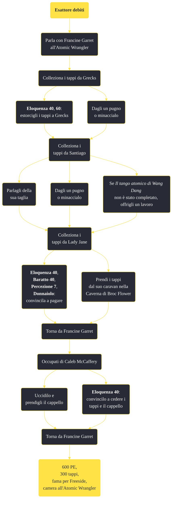

---
# Title, summary, and page position.
linktitle: "Esattore debiti"
summary: ""
weight: 10
icon: message-question
icon_pack: fas

# Page metadata.
title: "Esattore debiti"
date: 2022-11-15
type: book # Do not modify.
commentable: true
tags: "Missioni secondarie di Fallout: New Vegas"
hidden: true # Visibile nella sidebar
private: false # Nascosto dalle ricerche
---

*Esattore debiti* è una missione secondaria di Fallout: New Vegas. È data da Francine Garret all'Atomic Wrangler di Freeside.

**Riassunto**:
1. Parla con Francine Garret all'Atomic Wrangler
2. Colleziona i tappi da Grecks
   - **Eloquenza 40**, **60**: estorcigli i tappi a Grecks
   - Dagli un pugno o minaccialo
3. Colleziona i tappi da Santiago
   - Parlagli della sua taglia
   - Dagli un pugno o minaccialo
   - Se *Il tango atomico di Wang Dang* non è stato completato, offrigli un lavoro
4. Colleziona i tappi da Lady Jane
   -  **Eloquenza 40**, **Baratto 40**, **Percezione 7**, **Donnaiolo**: convincila a pagare
   -  Prendi i tappi dal suo caravan nella Caverna di Broc Flower
5.  Torna da Francine Garret
6.  Occupati di Caleb McCaffery
   -  Uccidilo e prendigli il cappello
   -  **Eloquenza 40**: convincilo a cedere i tappi e il cappello
7.  Torna da Francine Garret
8.  Ricompensa: **600 PE**, **300 tappi**, **fama per Freeside**, camera all'Atomic Wrangler

<section class="chart-collapse">
<input type="checkbox" name="collapse2" id="handle2">
<h3 class="handle">
<label for="handle2">Clicca per mostrare il diagramma</label>
</h3>

</section>

| Tappe |       Stato        | Descrizione |
|:-----:|:------------------:| ----------- |
|                           10                          |            | Raccogli 138 tappi da Grecks a Freeside.                                                                                                                                    |
|                           20                          |            | Raccogli 212 tappi da Santiago a Freeside.                                                                                                                                  |
|                           30                          |            | Trova e raccogli 250 tappi da Lady Jane.                                                                                                                                    |
|                           40                          |            | Trova la carovana di Lady Jane e raccogli i tappi da ciò che resta.                                                                                                         |
|                           50                          |            | Torna da Francine con 600 tappi.                                                                                                                                            |
|                           55                          |            | Torna da Francine con 388 tappi.                                                                                                                                            |
|                           60                          |            | Uccidi Caleb McCaffery.                                                                                                                                                     |
|                           80                          |            | Torna da Francine con il cappello di McCaffery.                                                                                                                             |
|                          100                          | :white_check_mark: | Ho consegnato il cappello di McCaffery a Francine e ho ricevuto la mia ricompensa.                                                                                          |

**Sfide abilità**:
- **Eloquenza 40**, **60**: per estorcere i tappi a Grecks
- **Eloquenza 50**: per estorcere i tappi a Santiago
- **Eloquenza 40**/**Baratto 40**/**Vedova nera**/**Percezione 7**: per estorcere i tappi a Lady Jane
- **Eloquenza 40**: per estorcere i tappi da Caleb

