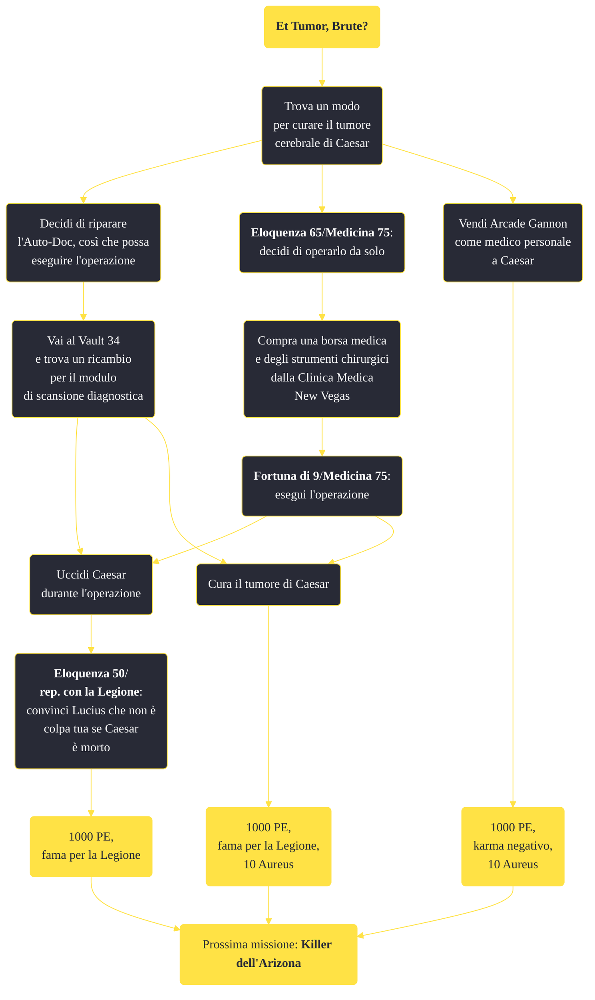

---
# Title, summary, and page position.
linktitle: "Et Tumor, Brute?"
summary: ""
weight: 10
icon: message-question
icon_pack: fas

# Page metadata.
title: "Et Tumor, Brute?"
date: 2022-11-15
type: book # Do not modify.
commentable: true
tags: "Missioni principali di Fallout: New Vegas"
hidden: true # Visibile nella sidebar
private: false # Nascosto dalle ricerche
---

*Et Tumor, Brute?* è una missione principale di Fallout: New Vegas. È data da Caesar al Forte.

<section class="chart-collapse">
<input type="checkbox" name="collapse2" id="handle2">
<h3 class="handle">
<label for="handle2">Clicca per mostrare il diagramma</label>
</h3>

</section>

| Tappe |       Stato        | Descrizione |
|:-----:|:------------------:| ----------- |
|                           10                          |            | Recupera un set di strumenti chirurgici.                                                                                                                                    |
|                           11                          |            | Per eseguire l'intervento è necessaria anche una borsa del dottore.                                                                                                         |
|                           15                          |            | Recupera un modulo di scansione diagnostica funzionale per l'Auto-Doc di Caesar.                                                                                            |
|                           20                          |            | Opera il cervello di Caesar per rimuovere il tumore che lo sta uccidendo.                                                                                                   |
|                           25                          |            | (Opzionale) Uccidi Caesar durante l'operazione in modo che sembri una morte naturale...                                                                                     |
|                           30                          |            | Installa il modulo di scansione diagnostica di ricambio nell'Auto-Doc di Caesar.                                                                                            |
|                           35                          | :white_check_mark: | Utilizza l'Auto-Doc per curare Caesar.                                                                                                                                      |
|                           40                          |   ❌  | (Opzionale) Utilizza l'Auto-Doc per uccidere Caesar.                                                                                                                        |
|                           45                          |            | (Opzionale) Schiavizza Arcade Gannon come medico personale di Caesar.                                                                                                       |

**Sfide abilità**:
- **Eloquenza 65**/**Medicina 75**/**Fortuna 9**: per curare Caesar
- **Eloquenza 50**/**Medicina 50**: per convincere Lucius che non è stata colpa del Corriere se Caesar è morto

**Note**:
- Non sarà possibile vendere Arcade Gannon a Caesar se viene reclutato dopo il colloquio privato con esso; è possibile venderlo invece a Lucius o subito dopo aver ucciso Caesar 

