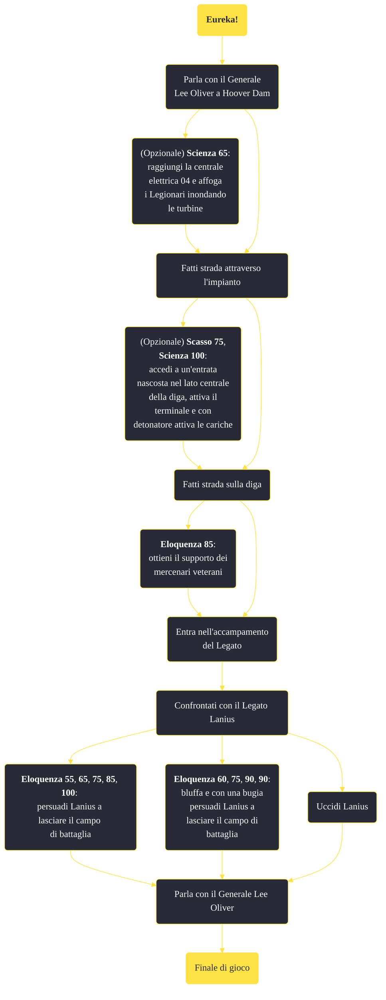

---
# Title, summary, and page position.
linktitle: "Eureka!"
summary: ""
weight: 10
icon: message-question
icon_pack: fas

# Page metadata.
title: "Eureka!"
date: 2022-11-15
type: book # Do not modify.
commentable: true
tags: "Missioni principali di Fallout: New Vegas"
hidden: true # Visibile nella sidebar
private: false # Nascosto dalle ricerche
---

*Eureka!* è una missione principale di Fallout: New Vegas. È data dal Generale Lee Oliver a Hoover Dam.

<section class="chart-collapse">
<input type="checkbox" name="collapse2" id="handle2">
<h3 class="handle">
<label for="handle2">Clicca per mostrare il diagramma</label>
</h3>

</section>

| Tappe |       Stato        | Descrizione |
|:-----:|:------------------:| ----------- |
|                           10                          |            | La Legione sta attaccando Hoover Dam, l'accampamento del Legato deve essere distrutto per proteggere la diga.                                                               |
|                           20                          |            | (Opzionale) Mike Lawson ha proposto di affogare i Legionari inondando le turbine per arrestare la loro invasione della stazione.                                            |
|                           25                          |            | (Opzionale) Attiva la valvola di scarico della pressione per affogare i Legionari inondando le turbine.                                                                     |
|                           30                          |            | Il flusso idrico della diga è stato deviato verso le turbine, la Legione non può più servirsene per accedere alla centrale elettrica.                                       |
|                           45                          | :white_check_mark: | La battaglia è stata vinta. Torna dal Generale Oliver                                                                                                                       |

**Sfide abilità**:
- **Scasso 75**: per aprire l'entrata nascosta sulla diga
- **Scienza 100**: attivare il detonatore per far saltare la carica esplosiva
- **Eloquenza 85**: conversando con i soldati mercenari veterani
- **Eloquenza 85**: per convincere Lanius a lottare uno contro uno
- **Eloquenza**/**Baratto 100**: per evitare di combattere contro Lanius

