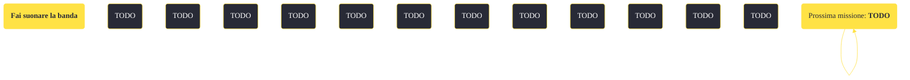

---
# Title, summary, and page position.
linktitle: "Fai suonare la banda"
summary: ""
weight: 10
icon: message-question
icon_pack: fas

# Page metadata.
title: "Fai suonare la banda"
date: 2022-11-15
type: book # Do not modify.
commentable: true
tags: "Missioni di Dead Money"
hidden: true # Visibile nella sidebar
private: false # Nascosto dalle ricerche
---

*Fai suonare la banda* è una missione del DLC *Dead Money* di Fallout:New Vegas. È data da Padre Elijah a Puesta del Sol.

<section class="chart-collapse">
<input type="checkbox" name="collapse2" id="handle2">
<h3 class="handle">
<label for="handle2">Clicca per mostrare il diagramma</label>
</h3>

</section>

| Tappe |       Stato        | Descrizione |
|:-----:|:------------------:| ----------- |
|                           10                          |            | Porta Dean sul tetto di Puesta del Sol.                                                                                                                                     |
|                           20                          |            | Parla con Dean e digli di rimanere in posizione e dare inizio all'evento di Gala.                                                                                           |
|                           30                          |            | Accendi entrambi gli ologrammi di sicurezza per tenere sotto controllo il cortile ai piedi di Dean.                                                                         |
|                           40                          |            | Dì a Dean che può prendere posizione al Gala in tutta sicurezza.                                                                                                            |
|                           50                          | :white_check_mark: | Ritorna sul tetto di Puesta del Sol con Dean.                                                                                                                               |

**Sfide abilità**:
- **Riparazione 60**: per riparare il quadro elettrico senza fusibili di riserva
- **Scienza 100**: per attivare il terminale senza la password di Ennis

