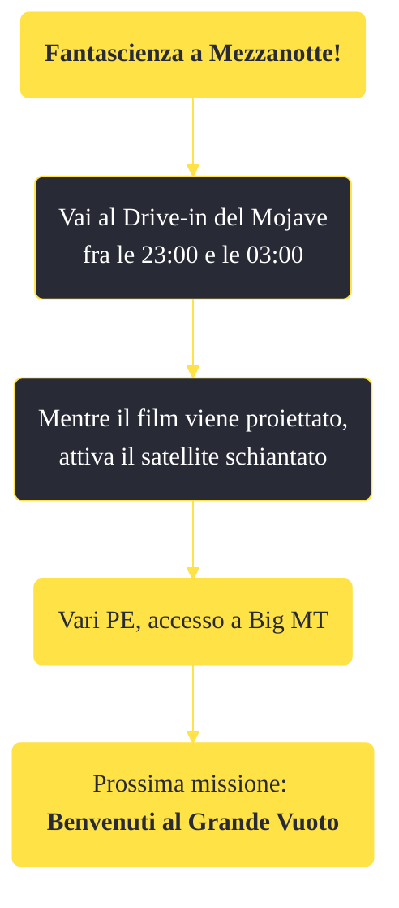

---
# Title, summary, and page position.
linktitle: "Fantascienza a Mezzanotte!" 
summary: ""
weight: 10
icon: message-question
icon_pack: fas

# Page metadata.
title: "Fantascienza a Mezzanotte!"
date: 2022-11-15
type: book # Do not modify.
commentable: true
tags: "Missioni di Old World Blues"
hidden: true # Visibile nella sidebar
private: false # Nascosto dalle ricerche
---

*Fantascienza a Mezzanotte!* è una missione del DLC *Old World Blues* di Fallout: New Vegas. È data dalla trasmissione misteriosa al Drive-In Mojave.

**Riassunto**:
1. Vai al Drive-in del Mojave fra le 23:00 e le 03:00
2. Mentre il film viene proiettato, attiva il satellite schiantato
3. Ricompensa: **vari PE**, accesso a Big MT
4. Prossima missione: *Benvenuti al Grande Vuoto*

<section class="chart-collapse">
<input type="checkbox" name="collapse2" id="handle2">
<h3 class="handle">
<label for="handle2">Clicca per mostrare il diagramma</label>
</h3>

</section>

| Tappe |       Stato        | Descrizione |
|:-----:|:------------------:| ----------- |
|                           10                          | :white_check_mark: | Indaga sulla proiezione di mezzanotte al drive-in del Mojave.                                                                                                               |

