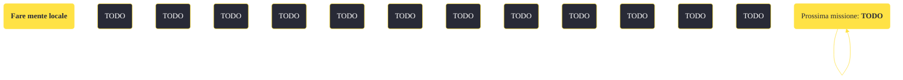

---
# Title, summary, and page position.
linktitle: "Fare mente locale" 
summary: ""
weight: 10
icon: message-question
icon_pack: fas

# Page metadata.
title: "Fare mente locale"
date: 2022-11-15
type: book # Do not modify.
commentable: true
tags: "Missioni di Old World Blues"
hidden: true # Visibile nella sidebar
private: false # Nascosto dalle ricerche
---

*Fare mente locale* è una missione del DLC *Old World Blues* di Fallout: New Vegas. È data dai dottori al Serbatoio del pensiero.

<section class="chart-collapse">
<input type="checkbox" name="collapse2" id="handle2">
<h3 class="handle">
<label for="handle2">Clicca per mostrare il diagramma</label>
</h3>

</section>

| Tappe |       Stato        | Descrizione |
|:-----:|:------------------:| ----------- |
|                           10                          |            | Parla con il Dr. Klein, anche senza paraorecchie.                                                                                                                           |
|                           20                          |            | Chiacchiera con il Dr. O.                                                                                                                                                   |
|                           30                          |            | Presentati alla D.ssa Dala.                                                                                                                                                 |
|                           40                          |            | Saluta il Dr. Borous. Piano.                                                                                                                                                |
|                           50                          | :white_check_mark: | "Parla" con Dr. 8, se ci riesci.                                                                                                                                            |

**Sfide abilità**:
- **Scienza ???**/**Medicina ???**: per ottenere alcune informazioni su Ulysses e Padre Elijah dal Dottor Klein
- **Eloquenza 65**/**Intelligenza 7**/**Ira matematica**: per scoprire il vero nome del Dottor O
- **Intelligenza 9**: per aiutare a distinguere la O con lo 0 nel nome del Dottor O
- **Medicina ???**/**Carisma ???**/**Cherchez La Femme**/**Donnaiolo**: per sbloccare alcuni dialoghi unici con la Dottoressa Dala
- **Percezione 7**/**Scienza 75**: per sbloccare alcuni dialoghi unici con il Dottor 8

**Note**:
- Parlando correttamente con tutti i membri del Serbatoio del pensiero, sarà possibile evitare il finale violento del DLC

