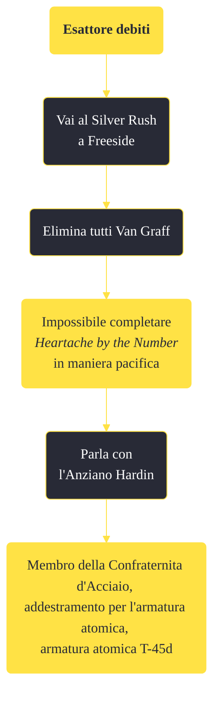

---
# Title, summary, and page position.
linktitle: "Esattore debiti"
summary: ""
weight: 10
icon: message-question
icon_pack: fas

# Page metadata.
title: "Esattore debiti"
date: 2022-11-15
type: book # Do not modify.
commentable: true
tags: "Missioni secondarie di Fallout: New Vegas"
hidden: true # Visibile nella sidebar
private: false # Nascosto dalle ricerche
---

*Esattore debiti* è una missione secondaria di Fallout: New Vegas. È data dall'Anziano Hardin nel bunker di Hidden Valley.

<section class="chart-collapse">
<input type="checkbox" name="collapse2" id="handle2">
<h3 class="handle">
<label for="handle2">Clicca per mostrare il diagramma</label>
</h3>

</section>

| Tappe |       Stato        | Descrizione |
|:-----:|:------------------:| ----------- |
|                           10                          |            | Uccidi i Van Graff e i loro uomini.                                                                                                                                         |
|                           20                          | :white_check_mark: | Torna dall'Anziano Hardin e riferiscigli che i Van Graff sono stati eliminati.                                                                                              |

**Note**:
- Questa missione è l'alternativa a *La vista ai ciechi*, che è data dall'Anziano McNamara se resta ancora in carica; quale delle due venga resa disponibile dipende dalle azioni del Corriere nella missione *Ancora nel buio*
  - Se hai già completato *La vista ai ciechi*, questa missione non verrà segnata come fallita fintanto che non verrà distrutta l'intera Confraternita
  - È possibile completare questa missione assieme a *Heartache by the Number* di Cass se si ha scelto l'opzione "violenta" 

