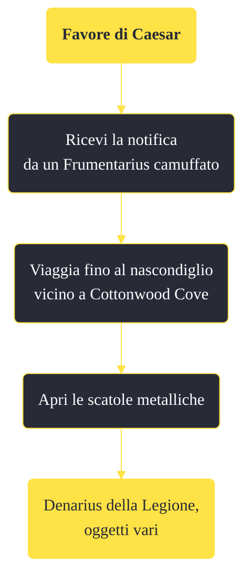

---
# Title, summary, and page position.
linktitle: "Favore di Caesar"
summary: ""
weight: 10
icon: message-question
icon_pack: fas

# Page metadata.
title: "Favore di Caesar"
date: 2022-11-15
type: book # Do not modify.
commentable: true
tags: "Missioni secondarie di Fallout: New Vegas"
hidden: true # Visibile nella sidebar
private: false # Nascosto dalle ricerche
---

*Favore di Caesar* è una missione secondaria di Fallout: New Vegas. È data dal Pip-Boy un volta raggiunta Cottonwood Cove.

<section class="chart-collapse">
<input type="checkbox" name="collapse2" id="handle2">
<h3 class="handle">
<label for="handle2">Clicca per mostrare il diagramma</label>
</h3>

</section>

| Tappe |       Stato        | Descrizione |
|:-----:|:------------------:| ----------- |
|                           10                          | :white_check_mark: | Trova la cassetta di consegna della Legione.                                                                                                                                |

**Note**:
- Fra gli strumenti ottenibili ci sono: borse mediche, armature da combattimento, armature da ricognizione, lanciafiamme, munizioni e Stealth Boy
- Maggiore è la fama per la Legione, migliore saranno gli strumenti

