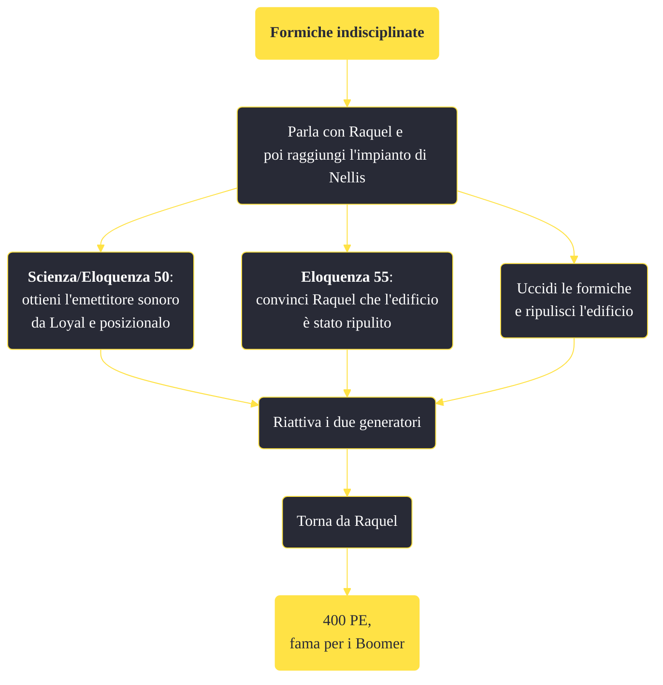

---
# Title, summary, and page position.
linktitle: "Formiche indisciplinate"
summary: ""
weight: 10
icon: message-question
icon_pack: fas

# Page metadata.
title: "Formiche indisciplinate"
date: 2022-11-15
type: book # Do not modify.
commentable: true
tags: "Missioni secondarie di Fallout: New Vegas"
hidden: true # Visibile nella sidebar
private: false # Nascosto dalle ricerche
---

*Formiche indisciplinate* è una missione secondaria di Fallout: New Vegas. È data da Raquel all'impianto della base aeronautica di Nellis.

**Riassunto**:
1. Parla con Raquel e poi raggiungi l'impianto di Nellis
   - **Scienza**/**Eloquenza 50**: ottieni l'emettitore sonoro da Loyal e posizionalo"
   - **Eloquenza 55**: convinci Raquel che l'edificio è stato ripulito
   - Uccidi le formiche e ripulisci l'edificio
2. Riattiva i due generatori
3. Torna da Raquel
4. Ricompensa: **400 PE**, **fama per i Boomer**

<section class="chart-collapse">
<input type="checkbox" name="collapse2" id="handle2">
<h3 class="handle">
<label for="handle2">Clicca per mostrare il diagramma</label>
</h3>

</section>

| Tappe |       Stato        | Descrizione |
|:-----:|:------------------:| ----------- |
|                           15                          |            | Riavvia i 2 generatori degli impianti, quindi ripristina il breaker di alimentazione principale.                                                                            |
|                           20                          |            | Uccidi le formiche nella sala generatori.                                                                                                                                   |
|                           35                          |            | (Opzionale) Loyal potrebbe avere qualcosa di utile contro le formiche.                                                                                                      |
|                           40                          |            | (Opzionale) Metti il generatore sonoro di Loyal sul cumulo di formiche.                                                                                                     |
|                           42                          |            | (Opzionale) Attiva l'emettitore sonoro.                                                                                                                                     |
|                           45                          | :white_check_mark: | Torna da Raquel e comunicale che i generatori funzionano di nuovo.                                                                                                          |

**Sfide abilità**:
- **Scienza**/**Eloquenza 50**: per ottenere l'emettitore sonoro da Loyal

**Note**:
- Il lanciagranate unico Thumper si può trovare vicino ad uno scheletro a est, nella parte inferiore dell'edificio 

