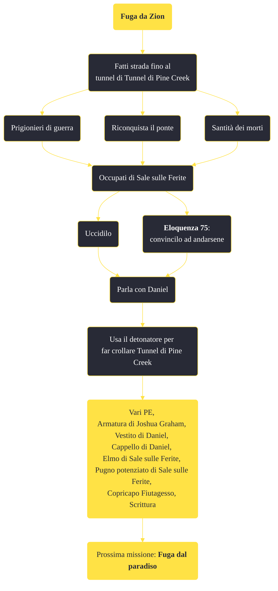

---
# Title, summary, and page position.
linktitle: "Fuga da Zion"
summary: ""
weight: 10
icon: message-question
icon_pack: fas

# Page metadata.
title: "Fuga da Zion"
date: 2022-11-15
type: book # Do not modify.
commentable: true
tags: "Missioni di Honest Hearts"
hidden: true # Visibile nella sidebar
private: false # Nascosto dalle ricerche
---

*Fuga da Zion* è una missione del DLC *Honest Hearts* di Fallout: New Vegas. È data da Joshua Graham.

<section class="chart-collapse">
<input type="checkbox" name="collapse2" id="handle2">
<h3 class="handle">
<label for="handle2">Clicca per mostrare il diagramma</label>
</h3>

</section>

| Tappe |       Stato        | Descrizione |
|:-----:|:------------------:| ----------- |
|                           20                          |            | Fatti strada fino al tunnel di Pine Creek.                                                                                                                                  |
|                           30                          |            | Affronta Sale sulle Ferite                                                                                                                                                  |
|                           40                          | :white_check_mark: | Parla con Daniel.                                                                                                                                                           |
|                           50                          | :white_check_mark: | Usa il detonatore per far crollare il tunnel di Pine Creek.                                                                                                                 |

**Sfide abilità**:
- **Eloquenza 75**: per convincere Sale sulle Ferite e gli Zampabianca a lasciare Zion

**Note**:
- Durante la missione, tutta la fauna selvatica scomparirà dalla mappa
- Non sarà possibile usare il viaggio rapido
- Fiutagesso e Nuvola Nascente smetteranno di seguirti e tutto ciò in loro possesso tornerà nel tuo inventario 

