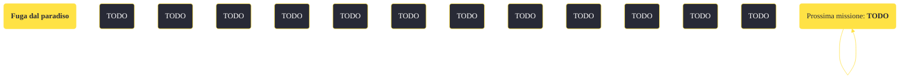

---
# Title, summary, and page position.
linktitle: "Fuga dal paradiso"
summary: ""
weight: 10
icon: message-question
icon_pack: fas

# Page metadata.
title: "Fuga dal paradiso"
date: 2022-11-15
type: book # Do not modify.
commentable: true
tags: "Missioni di Honest Hearts"
hidden: true # Visibile nella sidebar
private: false # Nascosto dalle ricerche
---

*Fuga dal paradiso* è una missione del DLC *Honest Hearts* di Fallout: New Vegas. È data dal Pip-Boy al passaggio sud.

<section class="chart-collapse">
<input type="checkbox" name="collapse2" id="handle2">
<h3 class="handle">
<label for="handle2">Clicca per mostrare il diagramma</label>
</h3>

</section>

| Tappe |       Stato        | Descrizione |
|:-----:|:------------------:| ----------- |
|                           10                          | :white_check_mark: | Torna nel Mojave dal Passaggio sud.                                                                                                                                         |

**Note**:
- Alcuni contenitori potrebbero resettarsi una volta tornati nel Mojave, inclusa la cassa con all'interno gli oggetti unici di Daniel, Joshua, Fiutagesso e Sale sulle Ferite

