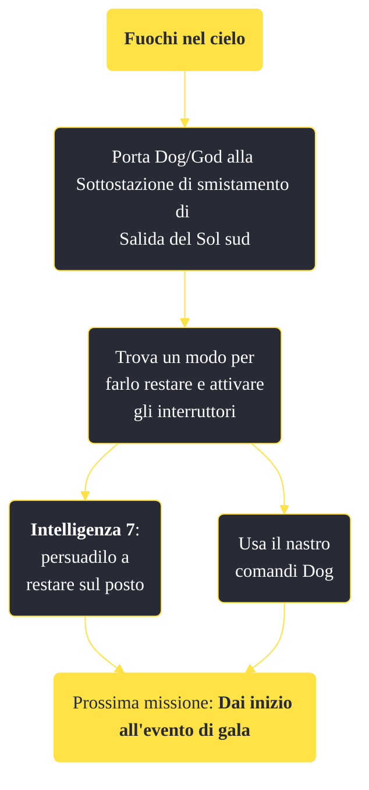

---
# Title, summary, and page position.
linktitle: "Fuochi nel cielo"
summary: ""
weight: 10
icon: message-question
icon_pack: fas

# Page metadata.
title: "Fuochi nel cielo"
date: 2022-11-15
type: book # Do not modify.
commentable: true
tags: "Missioni di Dead Money"
hidden: true # Visibile nella sidebar
private: false # Nascosto dalle ricerche
---

*Fuochi nel cielo* è una missione del DLC *Dead Money* di Fallout:New Vegas. È data da Padre Elijah a Salida del Sol.

**Riassunto**:
1. Porta Dog/God alla Sottostazione di smistamento di Salida del Sol sud
2. Trova un modo per farlo restare e attivare gli interruttori
   - Usa il nastro comandi Dog
   - **Intelligenza 7**: persuadilo a restare sul posto
3. Prossima missione: *Dai inizio all'evento di gala*

<section class="chart-collapse">
<input type="checkbox" name="collapse2" id="handle2">
<h3 class="handle">
<label for="handle2">Clicca per mostrare il diagramma</label>
</h3>

</section>

| Tappe |       Stato        | Descrizione |
|:-----:|:------------------:| ----------- |
|                           5                           |            | Vai alla Fontana e parla con Elijah per ottenere ulteriori istruzioni.                                                                                                      |
|                           10                          |            | Porta Dog alla Sottostazione di smistamento di Salida del Sol.                                                                                                              |
|                           20                          |            | Fai aspettare Dog alla Sottostazione di smistamento.                                                                                                                        |
|                           30                          |            | Trova due pezzi dei resti del fantasma mietitore per convincere Dog a restare nella Sottostazione di smistamento.                                                           |
|                           35                          | :white_check_mark: | (Opzionale) Usa il terminale della Sottostazione di smistamento per rinchiudere Dog e costringerlo a fare la sua parte nel Gala.                                            |
|                           40                          | :white_check_mark: | Ritorna da Dog con i resti del fantasma mietitore.                                                                                                                          |

**Sfide abilità**:
- **Intelligenza 7**: per convincere God ad andare alla Sottostazione di smistamento senza dover invocare Dog

**Note**:
- All'interno del Cafè rovinato c'è un letto puoi riposarti e rigenerare la salute
- Questa missione è l'ultima possibilità per apprendere la ricetta del Martini del Sierra Madre da Dean

