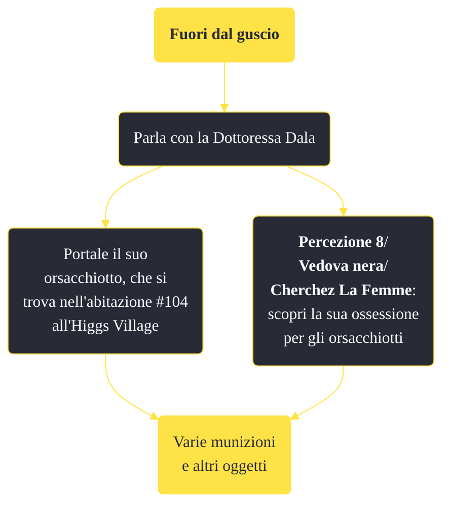

---
# Title, summary, and page position.
linktitle: "Fuori dal guscio" 
summary: ""
weight: 10
icon: message-question
icon_pack: fas

# Page metadata.
title: "Fuori dal guscio"
date: 2022-11-15
type: book # Do not modify.
commentable: true
tags: "Missioni di Old World Blues"
hidden: true # Visibile nella sidebar
private: false # Nascosto dalle ricerche
---

*Fuori dal guscio* è una missione del DLC *Old World Blues* di Fallout: New Vegas. È data dalla dottoressa Dala al Serbatoio del pensiero.

**Riassunto**:
1. Parla con la Dottoressa Dala
   - Portale il suo orsacchiotto, che si trova nell'abitazione #104 all'Higgs Village
   - **Percezione 8**/**Vedova nera**/**Cherchez La Femme**: scopri la sua ossessione per gli orsacchiotti
2. Ricompensa: varie **munizioni** e altri oggetti

<section class="chart-collapse">
<input type="checkbox" name="collapse2" id="handle2">
<h3 class="handle">
<label for="handle2">Clicca per mostrare il diagramma</label>
</h3>

</section>

| Tappe |       Stato        | Descrizione |
|:-----:|:------------------:| ----------- |
|                           10                          | :white_check_mark: | Scopri il motivo della passione biologica di Dala.                                                                                                                          |

**Sfide abilità**:
- **Percezione 8**/**Vedova nera**/**Cherchez La Femme**: per scoprire l'ossessione della Dottoressa Dala (il suo orsacchiotto si trova nell'abitazione #104 all'Higgs Village)

**Note**:
- Questa è una delle missioni secondarie più influenti per un finale pacifico del DLC

